# VPC de tres capas en AWS con Terraform

Infraestructura de red reutilizable que aísla una aplicación en tres capas —balanceador, aplicación y datos— repartidas en varias zonas de disponibilidad, con el tráfico entre capas controlado por referencias entre security groups en lugar de rangos de direcciones.

El objetivo no era desplegar una VPC. Era construir un módulo que **otra persona pueda reutilizar sin leerse el código**, que **no se pueda desplegar mal por descuido**, y cuyo **coste sea visible antes de ejecutar nada**. Las decisiones de abajo salen de esos tres criterios.

```mermaid
flowchart TB
    NET((Internet))

    subgraph VPC["VPC · 10.0.0.0/16"]
        subgraph PUB["Capa pública · 10.0.0.0/24 y 10.0.1.0/24"]
            IGW["Internet Gateway"]
            NAT["NAT Gateway"]
            ALB["Balanceador<br/>sg: alb"]
        end

        subgraph PRI["Capa privada · 10.0.16.0/24 y 10.0.17.0/24"]
            APP["Aplicación<br/>sg: app"]
            VPCE["Endpoints SSM<br/>administración sin SSH"]
        end

        subgraph DAT["Capa de datos · 10.0.32.0/24 y 10.0.33.0/24"]
            DB["Base de datos<br/>sg: db + NACL"]
        end
    end

    NET -->|"80 y 443"| ALB
    ALB -->|"8080"| APP
    APP -->|"5432"| DB
    APP -.->|"solo salida"| NAT
    NAT --> IGW
    IGW --> NET
    APP --- VPCE

    style DAT fill:#3d2b2b,stroke:#a05252
    style PRI fill:#2b3341,stroke:#527ba0
    style PUB fill:#2b3d33,stroke:#52a06e
```



La capa de datos no aparece conectada a internet en el diagrama porque **no lo está**: su tabla de rutas no contiene ninguna entrada `0.0.0.0/0`. No hay una regla que lo prohíba; simplemente no existe el camino.

---

## Empezar en dos minutos

Si solo quieres verlo funcionando, hay un ejemplo autocontenido que **no necesita preparación previa y no genera coste**. El state se guarda en un archivo local, así que no hace falta bucket ni bootstrap.

```bash
git clone <URL-DEL-REPO>
cd aws-three-tier-vpc-terraform/examples/minimal

terraform init
terraform apply     # crea la VPC, las 6 subredes, rutas, SGs y el NACL
terraform destroy   # cuando termines
```

Lo único que necesitas son credenciales de AWS con permiso para crear redes. Los dos recursos que cobran por hora vienen apagados; ver [Costes](#costes).

---

## Despliegue completo, paso a paso

El entorno de `envs/dev` sí guarda el state en S3, que es como se trabaja en equipo. Requiere una preparación que se hace **una sola vez por cuenta**.

### 1. Requisitos

- Terraform >= 1.11 — el bloqueo de state nativo de S3 (`use_lockfile`) es de esa versión en adelante
- AWS CLI configurado y con sesión activa
- Permisos para crear VPC, IAM, S3 y CloudWatch

```bash
terraform version
aws sts get-caller-identity   # debe responder con tu cuenta
```

### 2. Crear el bucket de state

Aquí hay un problema de huevo y gallina: este stack crea el bucket donde se guarda el state, incluido el suyo propio, que la primera vez todavía no existe. Se resuelve en dos pasos.

```bash
cd bootstrap

# Comenta el bloque backend de backend.tf y aplica con state local
terraform init
terraform apply

terraform output -raw tfstate_bucket_name   # apunta este nombre
```

Ahora descomenta el bloque `backend` y migra el state al bucket recién creado:

```bash
cp backend.hcl.example backend.hcl   # y pon dentro el nombre del bucket
terraform init -backend-config=backend.hcl -migrate-state
```

Esto no se repite nunca más.

### 3. Desplegar el entorno

```bash
cd ../envs/dev

cp backend.hcl.example backend.hcl   # el mismo bucket que arriba
terraform init -backend-config=backend.hcl

terraform plan
terraform apply
```

El bucket **no está escrito en el código**: su nombre lleva tu número de cuenta, y los nombres de bucket de S3 son únicos en todo AWS. Si estuviera fijo en `backend.tf`, este repositorio solo funcionaría en la cuenta de quien lo escribió. Por eso va en un `backend.hcl` que git ignora, con su plantilla `.example` versionada al lado.

### 4. Destruir al terminar

```bash
terraform destroy
```

Hay un atajo que además comprueba que no quedó nada encendido:

```bash
make nuke
make cost    # lista NAT, endpoints, instancias e IPs sin asociar
```

---

## Costes

Casi todo lo que crea este módulo es gratis. El gasto se concentra en dos recursos, y ambos se pueden apagar:

| Recurso | Coste aproximado | Variable que lo controla |
|---|---|---|
| VPC, subredes, rutas, IGW, security groups, NACL | **0** | — |
| NAT Gateway | ~1,08 USD/día cada uno, más el tráfico | `nat_strategy` |
| Interface endpoints de SSM | ~1,44 USD/día los 3 en 2 zonas | `enable_ssm_endpoints` |
| Instancia de demostración | ~0,25 USD/día | `enable_ssm_test` |
| Flow logs | Según volumen ingerido | `enable_flow_logs` |

Cifras orientativas de `us-east-1`; consulta el precio vigente de tu región.

`examples/minimal` y la suite de tests van con los dos primeros apagados, así que **ni probar el repositorio ni ejecutar los tests cuesta dinero**. Un `apply` de `envs/dev` con la configuración por defecto ronda los 2,50 USD al día, casi todo NAT y endpoints.

---

## Decisiones de diseño

**`for_each` con claves de texto en lugar de `count`.** Con `count`, la identidad de un recurso en el state es su posición. Eliminar la subred del medio corre todas las siguientes un puesto, y Terraform destruye y recrea recursos que nadie pidió tocar. Con claves como `private-us-east-1a`, borrar una afecta solo a esa. La contrapartida es que renombrar una clave sí fuerza la recreación, así que las claves combinan capa y zona: los dos únicos datos que no cambian.

**Las zonas se consultan, no se escriben.** AWS aleatoriza los nombres de zona por cuenta: `us-east-1a` puede ser un datacenter físico distinto en tu cuenta y en la mía. Fijarlas en el código hace que el reparto entre zonas sea impredecible al desplegar en otra cuenta.

**Los tags son datos, no etiquetas.** Las asociaciones de rutas y los outputs filtran por el tag `Tier`, no por el prefijo del nombre. Filtrar por el nombre sería depender de una convención de texto que cualquiera puede reformatear.

**Las capas se autorizan entre sí por referencia, nunca por CIDR.** Un rango de direcciones autoriza a cualquier cosa que aterrice en esa subred; una referencia a un security group autoriza solo a las instancias que lo tengan asignado, y sobrevive intacta a cualquier renumeración de la red. Sustituirlo por un CIDR es el atajo típico cuando algo no conecta: funciona, no da error, y abre la capa entera. Hay un test que lo vigila.

**Reglas como recurso propio** (`aws_vpc_security_group_ingress_rule`) en lugar de bloques `ingress` dentro del security group: cada regla tiene su entrada en el state, así que añadir una no reescribe las demás y el plan enseña exactamente cuál cambia.

**El security group por defecto se vacía.** AWS crea uno con cada VPC que permite todo el tráfico interno, y es el que se asigna a cualquier instancia lanzada sin especificar security group. Es la puerta trasera que salta todo el encadenamiento anterior. No se puede borrar, pero sí dejar sin reglas.

**Una tabla de rutas privada por zona desde el principio**, aunque con `nat_strategy = "single"` las dos apunten al mismo NAT. Pasar a un NAT por zona es entonces cambiar una variable, no reestructurar el módulo.

**Bloqueo de state nativo de S3.** Desde Terraform 1.11, `use_lockfile = true` sustituye a la tabla de DynamoDB que antes hacía falta solo para esto: un recurso menos que crear, pagar y mantener.

---

## Tres cosas que se rompieron

**Un NAT Gateway olvidado encendido.** Los tests desplegaban la red completa para comprobar una ruta. Si la ejecución se interrumpe —Ctrl+C, un portátil que se suspende— el teardown no llega a correr y el NAT se queda facturando. De ahí sale `nat_strategy = "none"`: la suite entera se ejecuta ahora sin crear un solo recurso facturable, y el interruptor resultó útil también para el ejemplo.

**El DNS de la VPC como prerrequisito invisible de SSM.** Con `enable_dns_hostnames` desactivado, los interface endpoints no resuelven sus nombres privados y Session Manager no conecta nunca. El error aparece varias fases después y no menciona el DNS en ningún momento. Hay un test dedicado a que nadie lo desactive por descuido.

**Un test que no se podía evaluar.** La comprobación de que la capa de aplicación referencia al balanceador fallaba con `Unknown condition value`: el ID de un security group no existe hasta el `apply`, y en `plan` es un valor desconocido. La solución fue separar las pruebas según lo que cada fase puede saber, y montar en `tests/setup/` una VPC de usar y tirar —deliberadamente más pequeña que el módulo real— sobre la que aplicar los security groups sin crear nada caro.

---

## Tests

```bash
terraform test
```

Cubren el conteo y el direccionamiento de las subredes, que la capa de datos no tenga ruta a internet, que el DNS siga activo, que los interruptores de coste realmente apaguen el NAT, y que las capas se sigan referenciando entre sí en lugar de por CIDR. **No crean recursos facturables.**

---

## Estructura

```
├── bootstrap/          Bucket de state versionado y cifrado. Se ejecuta una vez.
├── modules/
│   ├── network/        VPC, subredes, rutas, NAT, endpoints y flow logs
│   └── security/       Security groups encadenados, NACL y default SG vaciado
├── examples/minimal/   Despliegue de coste cero, sin backend remoto
├── envs/dev/           Entorno real con state en S3
└── tests/              Suite de terraform test
```

Cada módulo tiene su propio README con la tabla de entradas y salidas: [network](modules/network/README.md) · [security](modules/security/README.md).

---

## Licencia

MIT. Ver [LICENSE](LICENSE).
