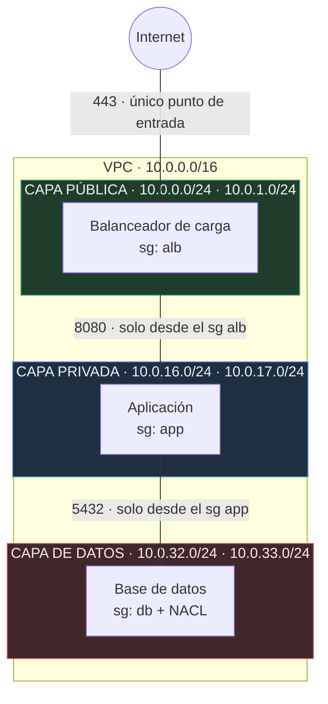
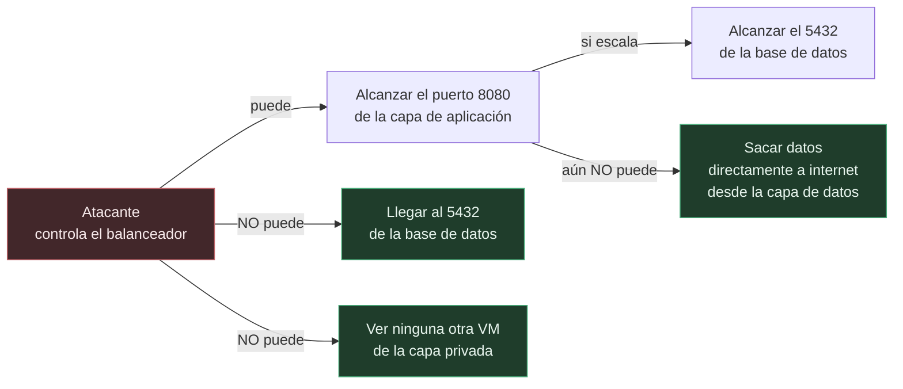
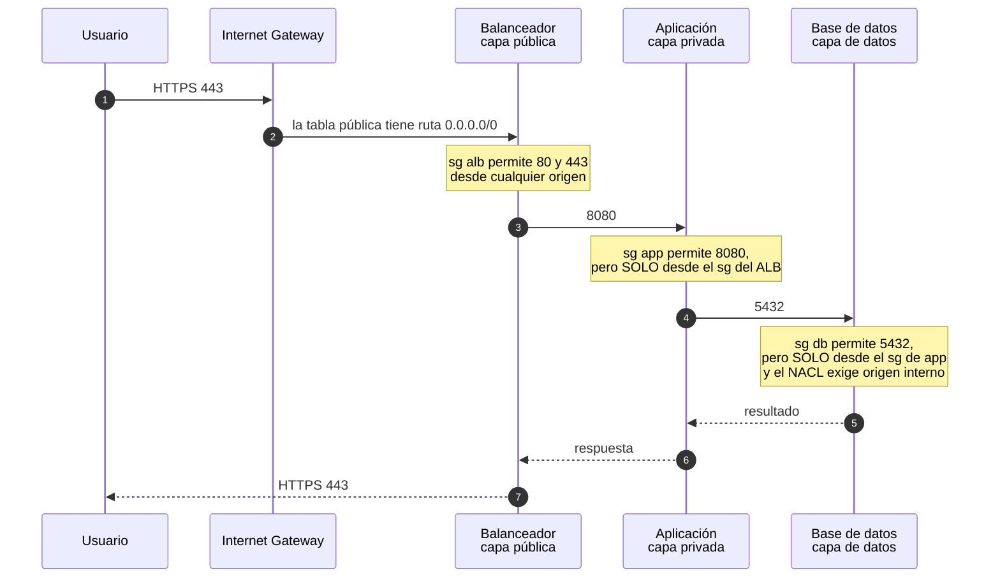
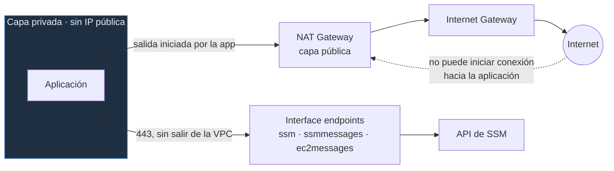
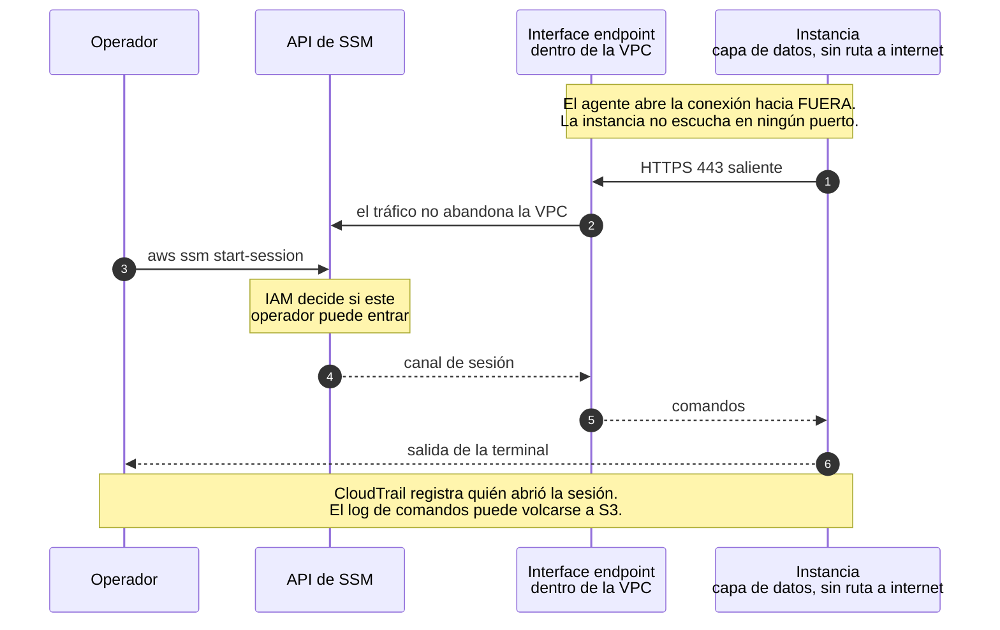
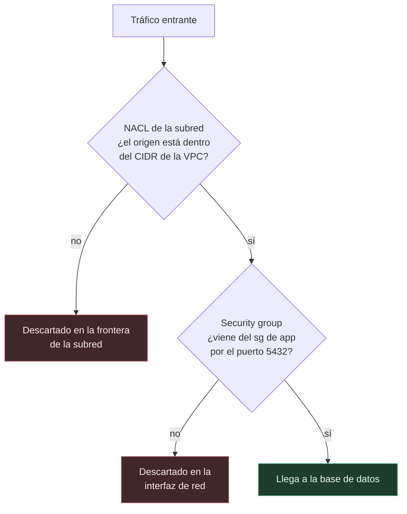

# VPC de tres capas en AWS con Terraform

En este proyecto construyes una red segmentada en AWS para alojar una aplicación web de tres capas: un balanceador de carga expuesto a internet, una capa de aplicación aislada y una capa de datos sin ninguna salida al exterior. Todo está escrito como módulos de Terraform reutilizables, se administra sin SSH ni bastión, y se verifica con pruebas automatizadas.

El repositorio está pensado tanto para desplegarse como para leerse. Cada sección explica primero **por qué** se toma una decisión y después **cómo** se implementa.

## Contenido

- [Información general](#información-general)
- [Arquitectura de tres capas](#arquitectura-de-tres-capas)
- [Cómo viaja una petición](#cómo-viaja-una-petición)
- [Diseño del direccionamiento](#diseño-del-direccionamiento)
- [Salida a internet sin exposición](#salida-a-internet-sin-exposición)
- [Administración sin SSH con Session Manager](#administración-sin-ssh-con-session-manager)
- [Dos barreras: NACL y security groups](#dos-barreras-nacl-y-security-groups)
- [El estado de Terraform en S3](#el-estado-de-terraform-en-s3)
- [Antes de empezar](#antes-de-empezar)
- [Paso 1: probar el módulo](#paso-1-probar-el-módulo)
- [Paso 2: crear el bucket de estado](#paso-2-crear-el-bucket-de-estado)
- [Paso 3: desplegar el entorno](#paso-3-desplegar-el-entorno)
- [Paso 4: comprobar el acceso sin SSH](#paso-4-comprobar-el-acceso-sin-ssh)
- [Limpieza](#limpieza)
- [Ejecutar las pruebas](#ejecutar-las-pruebas)
- [Decisiones de implementación](#decisiones-de-implementación)
- [Solución de problemas](#solución-de-problemas)
- [Referencia](#referencia)

---

## Información general

La plantilla despliega los siguientes recursos:

- Una VPC con resolución DNS habilitada
- Seis subredes, resultado de combinar tres capas con dos zonas de disponibilidad
- Un Internet Gateway y una tabla de rutas por capa
- NAT Gateway configurable, para que la capa privada pueda salir sin ser alcanzable
- Interface endpoints de Systems Manager, para administrar instancias sin abrir puertos
- Tres security groups encadenados y una lista de control de acceso a red en la capa de datos
- Flow logs de la VPC en CloudWatch



Observa que ninguna flecha conecta la capa de datos con internet. Esto no se consigue con una regla de denegación, sino con una ausencia: la tabla de rutas de esas subredes no contiene ninguna entrada hacia `0.0.0.0/0`. El camino no existe.

---

## Arquitectura de tres capas

### El punto de partida

La forma más rápida de desplegar una aplicación en AWS es una VPC plana: todas las instancias en subredes públicas, cada una con su dirección IP pública, y los security groups actuando como único filtro. Esta topología funciona y se despliega en minutos.

El inconveniente aparece cuando algo sale mal. En una red plana, toda instancia con IP pública forma parte de la superficie expuesta, y una única regla mal escrita puede dejar la base de datos accesible desde internet. Como todos los recursos comparten el mismo espacio de red, la corrección de la configuración depende por completo de que **todas** las reglas estén bien, todo el tiempo.

### Qué aporta segmentar

Al dividir la red en capas, la pregunta de seguridad cambia. En lugar de preguntarte si cada regla es correcta, puedes preguntarte qué alcance tendría un atacante que comprometiera una capa concreta. Esa pregunta sí tiene una respuesta acotada:



Cada capa acepta tráfico de una única procedencia y por un único puerto. El balanceador es lo único alcanzable desde internet, y a su vez es lo único que puede hablar con la capa de aplicación. La base de datos solo atiende a la aplicación. Comprometer una capa concede la siguiente, no el conjunto.

La capa de datos añade una propiedad que las demás no tienen. Al carecer de ruta de salida, tampoco sirve como vía de extracción: alguien que llegue hasta ahí tiene que regresar por el mismo camino, y ese camino atraviesa capas que sí registran su tráfico en los flow logs.

### Requisitos de cumplimiento

Existe además un motivo formal. PCI DSS, ISO 27001 y la mayoría de marcos de auditoría exigen que los datos residan en una red sin acceso directo a internet. Con esta topología, esa evidencia se aporta mostrando la tabla de rutas de la capa de datos, que no contiene ninguna ruta por defecto.

---

## Cómo viaja una petición



Presta atención a los pasos 3 y 5. Las reglas no autorizan un rango de direcciones, autorizan un **security group**. La regla de la capa de aplicación dice, literalmente, «acepto tráfico procedente de lo que tenga asignado el security group `alb`».

La diferencia se aprecia cuando alguien lanza una instancia nueva en la subred privada. Si la regla estuviera escrita con un CIDR, esa máquina heredaría permiso para hablar con la base de datos por el simple hecho de estar en la subred correcta. Con una referencia a security group, no lo obtiene salvo que alguien le asigne el grupo de forma deliberada. El permiso deja de depender de dónde está la máquina y pasa a depender de qué es.

Como ventaja adicional, estas reglas sobreviven a los cambios de direccionamiento. Si más adelante renumeras la red, siguen siendo correctas sin modificarlas.

---

## Diseño del direccionamiento

Esta es la parte que más condiciona el futuro de una VPC, porque **el bloque CIDR de una VPC no se puede reducir ni reasignar** una vez creada. Se pueden añadir bloques secundarios, pero el rango principal es permanente. Conviene razonarlo antes de escribir la primera línea.

### Elegir el rango de la VPC

Las direcciones privadas disponibles son las que define el RFC 1918:

| Rango | Máscara | Direcciones |
|---|---|---|
| `10.0.0.0` | `/8` | 16.777.216 |
| `172.16.0.0` | `/12` | 1.048.576 |
| `192.168.0.0` | `/16` | 65.536 |

Este proyecto usa `10.0.0.0/16`, que ofrece 65.536 direcciones. El criterio no es solo el tamaño: **dos VPC con rangos solapados no se pueden emparejar**. Si algún día necesitas VPC peering, un Transit Gateway o una VPN hacia una red corporativa, cualquier solapamiento te obliga a rehacer la red o a montar traducción de direcciones. Por eso conviene reservar un rango distinto para cada entorno y anotarlo en algún sitio.

> **Nota:** AWS admite máscaras entre `/16` y `/28` para una VPC. Un `/16` es un punto de partida cómodo porque deja el tercer octeto entero como espacio de maniobra.

### Cómo se calculan las subredes

Las subredes no están escritas a mano. Se calculan con la función `cidrsubnet` de Terraform, que toma una red y la divide:

```
cidrsubnet("10.0.0.0/16", 8, 17)
              │            │   │
              │            │   └── número de bloque que quieres
              │            └────── bits que añades al prefijo
              └─────────────────── red de partida

/16 + 8 bits = /24        →  el bloque 17 es 10.0.17.0/24
```

Añadir 8 bits a un `/16` produce redes `/24`, y como quedan 8 bits para numerar bloques, hay 256 bloques disponibles (`10.0.0.0/24` hasta `10.0.255.0/24`). El tercer octeto del resultado coincide con el número de bloque, lo que hace el direccionamiento legible a simple vista.

El número de bloque sale de sumar dos valores:

```hcl
cidr = cidrsubnet(var.vpc_cidr, 8, offset + idx)
```

- `offset` identifica la capa y viene de la variable `tier_offsets`
- `idx` identifica la zona de disponibilidad, y vale 0 para la primera, 1 para la segunda

Con los valores por defecto (`public = 0`, `private = 16`, `data = 32`) el resultado es:

| Capa | Offset | Zona a (idx 0) | Zona b (idx 1) |
|---|---|---|---|
| Pública | 0 | `10.0.0.0/24` | `10.0.1.0/24` |
| Privada | 16 | `10.0.16.0/24` | `10.0.17.0/24` |
| Datos | 32 | `10.0.32.0/24` | `10.0.33.0/24` |

### Por qué las capas se separan de 16 en 16

La separación entre offsets reserva 16 bloques `/24` a cada capa. Esto tiene dos consecuencias prácticas.

La primera es que puedes crecer hasta 16 zonas de disponibilidad por capa **sin renumerar nada**. Si mañana pasas de 2 a 3 zonas, la nueva subred privada será `10.0.18.0/24`, que está libre por construcción. Con capas contiguas, en cambio, añadir una zona invadiría el rango de la siguiente capa y obligaría a mover subredes existentes, lo que en Terraform significa destruir y recrear.

La segunda es la legibilidad operativa. Al mirar una dirección en un log o en una consola puedes deducir su capa por el tercer octeto: de 0 a 15 es pública, de 16 a 31 privada, de 32 a 47 datos. Durante una incidencia, esa lectura inmediata ahorra tiempo.

La variable incluye una validación que rechaza offsets que no sean múltiplos de 16, para que el esquema no se rompa por descuido:

```hcl
validation {
  condition     = alltrue([for o in values(var.tier_offsets) : o % 16 == 0])
  error_message = "Cada offset debe ser múltiplo de 16 para reservar 16 bloques /24 por capa."
}
```

### Por qué subredes /24

Un `/24` contiene 256 direcciones, de las cuales AWS reserva cinco en toda subred:

| Dirección | Uso |
|---|---|
| `.0` | Identificador de red |
| `.1` | Router de la VPC |
| `.2` | Servidor DNS de AWS |
| `.3` | Reservada para uso futuro |
| `.255` | Dirección de difusión |

Quedan por tanto **251 direcciones utilizables** por subred. Es un tamaño equilibrado para la mayoría de cargas de trabajo.

Merece la pena conocer el compromiso en ambas direcciones. Si eliges subredes más pequeñas, como un `/26` con 59 direcciones útiles, corres el riesgo de agotarlas: en Amazon EKS cada pod consume una dirección de la subred, y en Fargate cada tarea consume otra, de modo que una subred pequeña limita la escalabilidad mucho antes que la CPU o la memoria. Si eliges subredes mayores, como un `/20`, desperdicias espacio de direccionamiento que quizá necesites para futuras capas o entornos dentro del mismo rango.

> **Nota:** el tamaño de subred se puede cambiar en el módulo modificando el segundo argumento de `cidrsubnet`, pero hacerlo sobre una red ya desplegada implica recrear las subredes y todo lo que viva en ellas.

---

## Salida a internet sin exposición

La capa privada plantea una necesidad aparentemente contradictoria: la aplicación tiene que salir a internet para descargar actualizaciones o consumir APIs de terceros, pero nadie desde fuera debe poder iniciar una conexión hacia ella. Son dos capacidades distintas, y conviene no confundirlas.



El NAT Gateway resuelve la primera mitad. Traduce las conexiones que **salen** y permite el regreso de sus respuestas, pero no acepta conexiones iniciadas desde el exterior. Es asimétrico por diseño.

La variable `nat_strategy` controla cuántos se despliegan:

| Valor | NAT desplegados | Comportamiento ante la caída de una zona |
|---|---|---|
| `none` | Ninguno | La capa privada no tiene salida en ningún caso |
| `single` | Uno, en la primera zona | Si cae esa zona, **todas** las subredes privadas pierden la salida |
| `per_az` | Uno por zona | Las zonas restantes siguen operando con normalidad |

Las tablas de rutas privadas se crean por zona en los tres casos, de modo que pasar de `single` a `per_az` consiste en cambiar una variable y no en reestructurar el módulo.

---

## Administración sin SSH con Session Manager

Para administrar máquinas en subredes privadas, el patrón tradicional es el **bastión**: una instancia en la subred pública con el puerto 22 accesible, desde la que se salta al resto de la red.

Ese diseño arrastra varias consecuencias:

- El puerto 22 queda expuesto a internet y recibe intentos de acceso de forma continua
- Hay que distribuir claves SSH al equipo, rotarlas periódicamente y revocarlas cuando alguien cambia de puesto o se marcha
- El bastión es una máquina más que parchear y supervisar
- Ante una auditoría, responder quién accedió a qué máquina y qué ejecutó depende de que alguien haya configurado y conservado los registros del propio bastión

Session Manager invierte la dirección de la conexión:



La comparación queda así:

| | Bastión con SSH | Session Manager |
|---|---|---|
| Puertos de entrada abiertos | 22, expuesto a internet | Ninguno |
| Credenciales | Claves SSH que distribuir y rotar | IAM; al retirar el permiso, el acceso cesa de inmediato |
| Auditoría | Los registros del bastión, si se conservan | CloudTrail por sesión, con volcado opcional de comandos a S3 o CloudWatch |
| Infraestructura adicional | Una instancia que mantener y parchear | Ninguna |
| Funciona sin salida a internet | No, salvo con configuraciones adicionales | Sí, mediante interface endpoints |

El módulo despliega tres endpoints, y los tres son necesarios:

| Endpoint | Función |
|---|---|
| `ssm` | La API de Systems Manager |
| `ssmmessages` | El canal de datos de la sesión interactiva |
| `ec2messages` | La comunicación del agente con el servicio |

Son estos endpoints los que permiten que el mecanismo funcione en la capa de datos, que no tiene ruta a internet. El tráfico hacia la API de AWS entra por una interfaz de red situada dentro de tu propia VPC y no llega a circular por la red pública.

> **Nota:** Session Manager depende de que la VPC tenga `enable_dns_support` y `enable_dns_hostnames` activados. Sin resolución DNS, los endpoints no resuelven sus nombres privados y la sesión nunca se establece. Ambos valores están fijados en el módulo y hay una prueba automatizada que lo verifica.

---

## Dos barreras: NACL y security groups

La capa de datos está protegida por dos mecanismos, y no se trata de la misma medida aplicada dos veces:



Se diferencian en tres aspectos:

**Dónde actúan.** La NACL filtra en la frontera de la subred, antes de que el paquete alcance la máquina. El security group filtra en la interfaz de red de la instancia.

**Quién los administra.** Una persona con permisos sobre EC2 puede modificar un security group. La NACL se gestiona a nivel de red, que en una organización con separación de funciones corresponde a otro equipo y a otro conjunto de permisos. Un error en un lado no atraviesa el otro.

**Cómo se comportan.** El security group mantiene estado: si permites la entrada, la respuesta sale automáticamente. La NACL no mantiene estado, y por eso hay que declarar la regla de salida de forma explícita. Este es el detalle que causa más confusión la primera vez, y el motivo de que el módulo declare ambas direcciones:

```hcl
resource "aws_network_acl_rule" "data_egress_vpc" {
  network_acl_id = aws_network_acl.data.id
  rule_number    = 100
  egress         = true          # sin esta regla, las respuestas no salen
  protocol       = "-1"
  rule_action    = "allow"
  cidr_block     = var.vpc_cidr
}
```

Todo lo que no coincida con una regla queda denegado por la regla implícita que cierra cada NACL y que no se puede eliminar.

---

## El estado de Terraform en S3

Terraform mantiene un archivo de estado con la correspondencia entre lo que declara tu código y lo que existe realmente en AWS. Es el registro que le permite saber que `aws_vpc.this` corresponde a `vpc-0b6e701a441c2648c`.

### Por qué no dejarlo en local

Por defecto ese archivo se guarda junto al código, y esa opción presenta varios problemas en cuanto el proyecto deja de ser individual:

- **Nadie más puede trabajar.** Si el estado está en tu portátil, un compañero que ejecute `apply` no sabe qué existe ya e intenta crear recursos duplicados.
- **No hay bloqueo.** Dos ejecuciones simultáneas parten del mismo estado y la última en escribir sobrescribe a la otra, dejando recursos huérfanos que Terraform ya no controla.
- **No hay copia de seguridad.** El estado es el único registro de lo desplegado. Si se corrompe o se borra, recuperar el control implica importar los recursos uno a uno.
- **Se versiona por accidente.** El archivo contiene valores en claro, incluidos los que marques como sensibles. Acaba en el repositorio con más frecuencia de la deseable.

### Qué aporta el bucket

El stack de `bootstrap/` crea un bucket de S3 configurado para resolver esos puntos:

| Configuración | Qué resuelve |
|---|---|
| Versionado | Cada `apply` deja una versión anterior recuperable, lo que permite volver atrás tras una escritura corrupta |
| Cifrado en reposo | El estado contiene valores sensibles |
| Bloqueo de acceso público | Impide que una política mal escrita lo exponga |
| Política que deniega tráfico sin TLS | Rechaza cualquier acceso que no viaje cifrado |
| `prevent_destroy` | Evita que un `terraform destroy` en ese directorio elimine el estado de todos los entornos |

El bloqueo de concurrencia se activa con una línea:

```hcl
terraform {
  backend "s3" {
    key          = "network/dev/terraform.tfstate"
    encrypt      = true
    use_lockfile = true
  }
}
```

> **Nota:** `use_lockfile` está disponible a partir de Terraform 1.11. En versiones anteriores el bloqueo requería una tabla de DynamoDB dedicada exclusivamente a esa función, con su propio coste y mantenimiento. Si consultas guías más antiguas, verás esa tabla en todos los ejemplos.

### Un estado por entorno

Cada entorno escribe en una ruta distinta del mismo bucket, indicada por el atributo `key`. Dos configuraciones que apuntaran a la misma ruta compartirían estado, y un `apply` en una podría destruir los recursos de la otra. La separación por `key` mantiene acotado el alcance de cualquier error.

### El nombre del bucket no está en el código

Los nombres de bucket de S3 son únicos **en todo AWS**, no dentro de tu cuenta. Como el nombre incluye el identificador de cuenta, escribirlo en `backend.tf` haría que el repositorio solo funcionase en la cuenta de quien lo creó: cualquier otra persona fallaría en el primer `init`.

Por eso el bloque `backend` se deja incompleto y los valores se aportan al inicializar, mediante un archivo `backend.hcl` que git ignora y del que se versiona una plantilla `.example`. Esta técnica se conoce como *partial backend configuration*.

El backend se evalúa antes que las variables y los `locals`, así que no existe forma de calcular ese nombre dentro de Terraform.

---

## Antes de empezar

Necesitas:

- **Terraform 1.11 o superior**, por el bloqueo nativo de S3
- **AWS CLI** configurado con credenciales válidas
- Permisos para crear recursos de VPC, IAM, S3 y CloudWatch

Comprueba ambos requisitos:

```bash
terraform version
aws sts get-caller-identity
```

---

## Paso 1: probar el módulo

Antes de montar el backend remoto puedes desplegar la arquitectura completa con el ejemplo autocontenido, que guarda el estado en un archivo local y no requiere ninguna preparación previa.

```bash
git clone git@github.com:Rxcxrdx/aws-three-tier-vpc-terraform.git
cd aws-three-tier-vpc-terraform/examples/minimal

terraform init
terraform apply
```

Al terminar, consulta lo que se ha creado:

```bash
terraform output subnets_by_tier
```

Para eliminarlo:

```bash
terraform destroy
```

---

## Paso 2: crear el bucket de estado

Este paso se realiza **una sola vez por cuenta**. El stack de `bootstrap/` crea el bucket donde los entornos guardarán su estado, incluido el suyo propio, lo que plantea una dependencia circular: la primera ejecución no puede usar un bucket que aún no existe.

Se resuelve en dos fases.

**Fase 1.** Abre `bootstrap/backend.tf` y comenta el bloque `terraform { backend "s3" { ... } }`. Terraform usará entonces un estado local:

```bash
cd bootstrap
terraform init
terraform apply

terraform output -raw tfstate_bucket_name
```

Anota el nombre que devuelve el último comando.

**Fase 2.** Descomenta el bloque, prepara la configuración del backend y migra el estado al bucket recién creado:

```bash
cp backend.hcl.example backend.hcl
# edita backend.hcl con el nombre del bucket

terraform init -backend-config=backend.hcl -migrate-state
```

Terraform detecta que hay un estado local y ofrece copiarlo al backend remoto. Al aceptar, el archivo local queda obsoleto y puede eliminarse.

---

## Paso 3: desplegar el entorno

```bash
cd ../envs/dev

cp backend.hcl.example backend.hcl
# el mismo bucket del paso anterior

terraform init -backend-config=backend.hcl
terraform plan
terraform apply
```

Revisa siempre la salida de `plan` antes de aplicar. Debe crear la VPC, seis subredes, las tablas de rutas, el NAT Gateway, los tres endpoints de SSM, los security groups y la NACL.

---

## Paso 4: comprobar el acceso sin SSH

El repositorio incluye una demostración que verifica el acceso sin SSH en el escenario más restrictivo posible: una instancia en la **subred de datos**, que no tiene ruta a internet ni par de claves asociado.

Viene desactivada porque es una comprobación puntual y no forma parte de la infraestructura:

```bash
terraform apply -var enable_ssm_test=true

aws ssm start-session --target $(terraform output -raw instance_id)
```

Si la sesión se abre, has verificado tres cosas a la vez: que los endpoints resuelven, que el rol de IAM concede los permisos correctos y que no hace falta ningún puerto de entrada. Para retirarla:

```bash
terraform apply -var enable_ssm_test=false
```

---

## Limpieza

```bash
cd envs/dev
terraform destroy
```

El repositorio incluye atajos equivalentes:

```bash
make nuke     # destruye el entorno
make cost     # comprueba que no queda nada activo en la cuenta
```

> **Nota:** el stack de `bootstrap/` no se destruye al terminar una sesión de trabajo. Contiene el estado de los entornos y lleva `prevent_destroy` precisamente para evitarlo.

---

## Ejecutar las pruebas

```bash
terraform test
```

La suite verifica:

- Que se crea una subred por combinación de capa y zona
- Que los bloques CIDR resultantes coinciden con el offset esperado
- Que las subredes de datos no asignan IP pública
- Que la tabla de rutas de la capa de datos no contiene ninguna ruta hacia `0.0.0.0/0`
- Que la resolución DNS sigue activa, por ser prerrequisito de Session Manager
- Que las capas se referencian por security group y no por CIDR
- Que el security group por defecto queda sin reglas

Las pruebas se ejecutan con `nat_strategy = "none"` y los endpoints desactivados, de modo que la suite no despliega infraestructura persistente.

---

## Decisiones de implementación

**`for_each` con claves de texto en lugar de `count`.** Con `count`, la identidad de un recurso en el estado es su posición en la lista. Al eliminar un elemento intermedio, todos los siguientes se desplazan y Terraform destruye y recrea recursos que no habían cambiado. Con claves como `private-us-east-1a`, eliminar una subred afecta únicamente a esa. Como contrapartida, renombrar una clave sí fuerza la recreación, por lo que las claves se componen de capa y zona: los dos atributos que no cambian durante la vida del recurso.

**Las zonas de disponibilidad se consultan con un data source.** AWS asigna los nombres de zona de forma aleatoria por cuenta, de manera que `us-east-1a` puede corresponder a instalaciones físicas distintas en dos cuentas diferentes. Fijar los nombres en el código haría impredecible el reparto entre zonas al desplegar en otra cuenta.

**Los tags se usan como datos.** Las asociaciones de tablas de rutas y los outputs filtran por el tag `Tier`. La alternativa sería interpretar el prefijo del nombre de la clave, lo que crearía una dependencia con un formato de texto que cualquiera puede modificar.

**Las reglas de firewall son recursos independientes.** Usar `aws_vpc_security_group_ingress_rule` en lugar de bloques `ingress` anidados hace que cada regla tenga su propia entrada en el estado. Añadir una no reescribe las demás, y el `plan` muestra exactamente cuál cambia.

**El security group por defecto se vacía.** AWS crea uno junto con cada VPC que permite todo el tráfico entre los recursos que lo tengan asignado, y es el que reciben las instancias lanzadas sin especificar security group. Al no poder eliminarse, el módulo lo adopta y lo deja sin reglas, de forma que una instancia que caiga ahí por descuido no pueda comunicarse con nada.

---

## Solución de problemas

**El apply falla al crear los VPC endpoints en una región distinta de `us-east-1`.** El nombre del servicio de un endpoint incluye la región. Si está escrito de forma fija, desplegar en otra región produce un error que no menciona la región como causa. El módulo lo obtiene con `data "aws_region"`, por lo que funciona en cualquiera.

**Session Manager no conecta aunque los endpoints existan.** Comprueba `enable_dns_support` y `enable_dns_hostnames` en la VPC. Sin ellos los endpoints no resuelven sus nombres privados. El síntoma aparece varias fases después de la causa y el mensaje de error no menciona el DNS.

**Una prueba falla con `Unknown condition value`.** La aserción depende de un valor que no se conoce hasta el `apply`, como el identificador de un security group. Durante el `plan` ese valor aparece como *known after apply* y la condición no puede evaluarse. La solución es ejecutar esa prueba con `command = apply`, o reformular la aserción sobre un atributo que sí se conozca en la fase de planificación.

**Queda un NAT Gateway activo tras interrumpir las pruebas.** Si una ejecución se corta antes de la fase de teardown, los recursos creados permanecen. Ejecuta `make cost` para localizarlos. Las pruebas de este repositorio usan `nat_strategy = "none"` para que esa situación no llegue a producirse.

---

## Referencia

### Estructura del repositorio

```
├── bootstrap/          Bucket de estado versionado y cifrado. Se ejecuta una vez.
├── modules/
│   ├── network/        VPC, subredes, rutas, NAT, endpoints y flow logs
│   └── security/       Security groups encadenados, NACL y default SG vaciado
├── examples/minimal/   Despliegue autocontenido con estado local
├── envs/dev/           Entorno con estado remoto en S3
└── tests/              Suite de terraform test
```

### Documentación de los módulos

Cada módulo documenta sus entradas, salidas y compromisos de diseño:

- [modules/network](modules/network/README.md)
- [modules/security](modules/security/README.md)
- [bootstrap](bootstrap/README.md)

### Licencia

MIT. Consulta el archivo [LICENSE](LICENSE).
