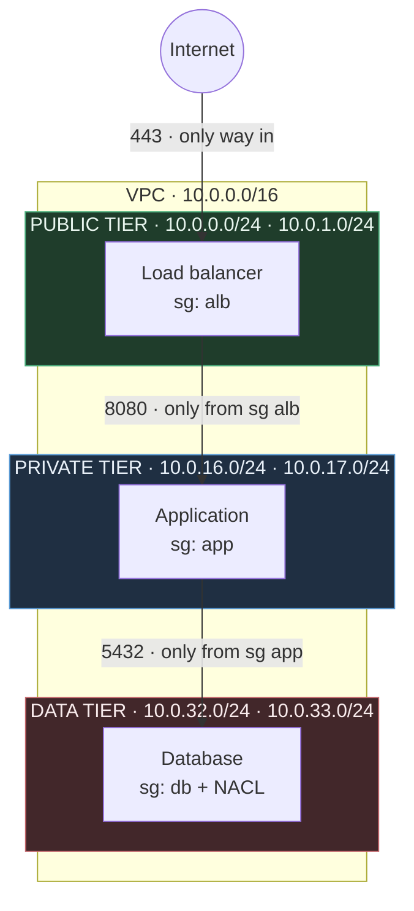
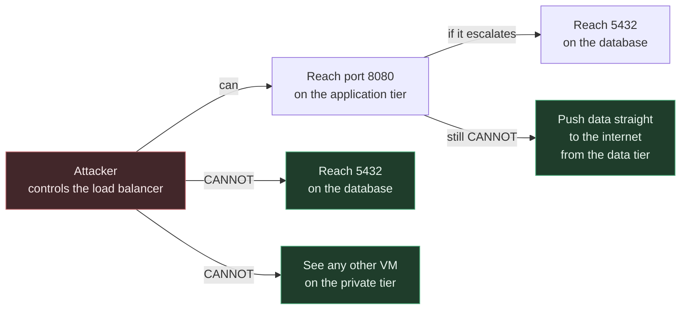
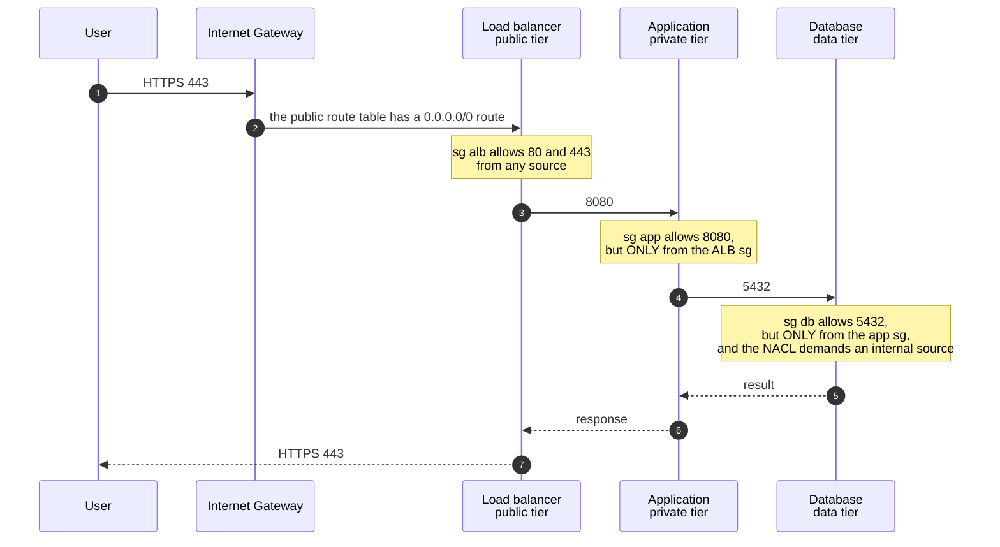
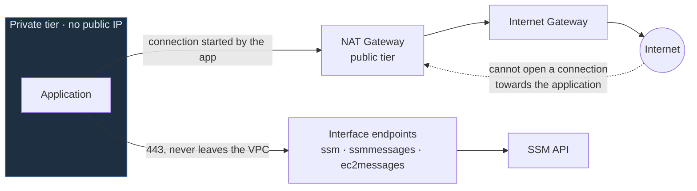
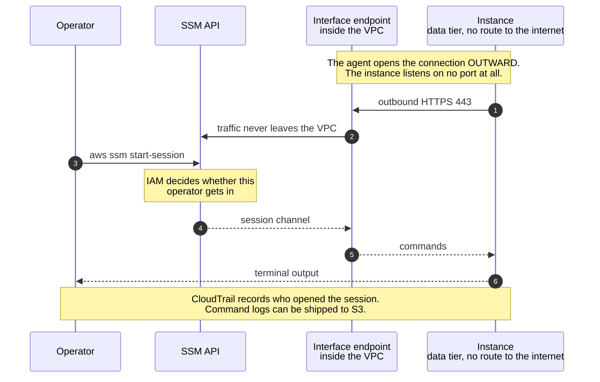
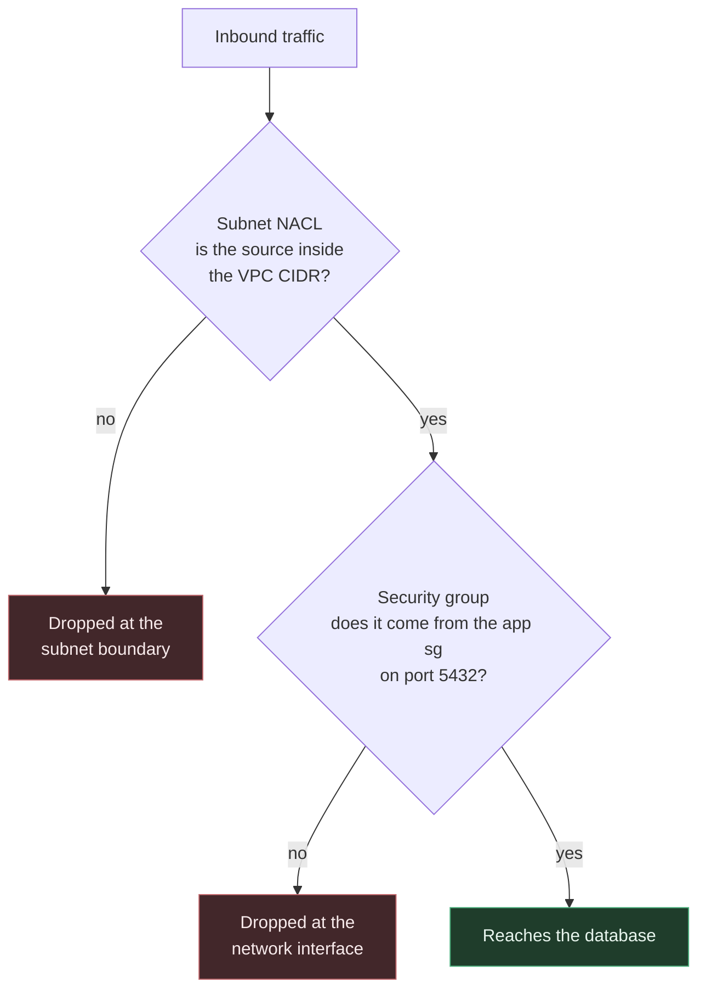

<h1 align="center">Three-Tier VPC on AWS with Terraform</h1>

<p align="center">
  = 1.11">
   5.0">
  
  
  
</p>

<p align="center">
  A segmented AWS network for a three-tier web app.<br>
  Reusable Terraform modules, no SSH, no bastion, covered by automated tests.
</p>



## Table of contents

- [Project description](#project-description)
- [Project status](#project-status)
- [Features](#features)
- [Architecture](#architecture)
  - [Why three tiers](#why-three-tiers)
  - [How a request travels](#how-a-request-travels)
  - [Addressing design](#addressing-design)
  - [Egress without exposure](#egress-without-exposure)
  - [SSH-free access with Session Manager](#ssh-free-access-with-session-manager)
  - [Two barriers on the data tier](#two-barriers-on-the-data-tier)
  - [Terraform state on S3](#terraform-state-on-s3)
- [Running the project](#running-the-project)
  - [Requirements](#requirements)
  - [Step 1. Try the module](#step-1-try-the-module)
  - [Step 2. Create the state bucket](#step-2-create-the-state-bucket)
  - [Step 3. Deploy the environment](#step-3-deploy-the-environment)
  - [Step 4. Prove SSH-free access](#step-4-prove-ssh-free-access)
  - [Cleanup](#cleanup)
  - [Tests](#tests)
- [Technologies used](#technologies-used)
- [Implementation decisions](#implementation-decisions)
- [Troubleshooting](#troubleshooting)
- [Bugs](#bugs)
- [Author](#author)
- [License](#license)

---

## Project description

This project builds a segmented AWS network for a three-tier web application. A load balancer open to the internet, an isolated application tier, and a data tier with no route out.

It is written as reusable Terraform modules. Machines are administered without SSH and without a bastion host. Ten automated tests cover the acceptance criteria, and none of them leave billable infrastructure behind.

The repository is meant to be deployed and also to be read. Every section states why a decision was made before showing how it was implemented.

## Project status

Stable and complete. The modules deploy, and the documentation matches the code.

The natural next steps would be a CI pipeline and a `prod` environment using `nat_strategy = "per_az"`.

## Features

- A VPC with DNS resolution enabled
- Six subnets, three tiers across two availability zones
- An Internet Gateway and one route table per tier
- Configurable NAT Gateway, so the private tier can reach out without being reachable
- Systems Manager interface endpoints, so you can get a shell without opening any port
- Three chained security groups plus a network ACL on the data tier
- VPC flow logs in CloudWatch
- A self-contained example that runs with local state and no setup

Look at what the diagram above is missing. No arrow connects the data tier to the internet. That is not achieved with a deny rule. It is achieved with an absence, because the route table for those subnets has no `0.0.0.0/0` entry at all. The path does not exist.

---

## Architecture

### Why three tiers

The fastest way to ship something on AWS is a flat VPC. Every instance in a public subnet, each with a public IP, and security groups as the only filter. It works and it takes minutes.

The problem shows up when something goes wrong. Any instance with a public IP is part of the attack surface. One badly written rule leaves the database reachable from the internet. Since everything shares the same network space, correctness depends on every rule being right all of the time.

Splitting the network into tiers changes the security question. It stops being whether each rule is correct. It becomes how far someone gets after compromising one tier. And that question has a bounded answer.



Each tier accepts traffic from one place and on one port. The load balancer is the only thing reachable from the internet, and the only thing that talks to the application. The database only answers the application. Compromising one tier buys the next one, not the whole thing.

The data tier has something the others do not. With no egress route, it is also useless for pulling data out. Whoever lands there has to go back the way they came, and that path crosses tiers that record their traffic in flow logs.

There is a duller reason too. PCI DSS, ISO 27001 and most audit frameworks require data to sit on a network with no direct internet access. The evidence is the data tier route table, which has no default route.

### How a request travels



Look at steps 3 and 5. The rules do not authorize an address range, they authorize a security group. The application tier rule says it accepts traffic from whatever carries the `alb` security group.

The difference shows up when someone launches a new machine in the private subnet. With a CIDR, that machine can talk to the database just by sitting in the right subnet. With a security group reference it cannot, unless someone assigns the group on purpose. The permission stops depending on where the machine is and starts depending on what it is.

These rules also survive renumbering. If you change the addressing tomorrow, they are still correct without edits.

### Addressing design

A VPC CIDR block cannot be shrunk or changed once the VPC exists. You can add secondary blocks, but the primary range is permanent. It is worth thinking through before writing the first line.

RFC 1918 defines the private ranges available.

| Range | Mask | Addresses |
|---|---|---|
| `10.0.0.0` | `/8` | 16,777,216 |
| `172.16.0.0` | `/12` | 1,048,576 |
| `192.168.0.0` | `/16` | 65,536 |

We use `10.0.0.0/16`, which gives 65,536 addresses. But size is not the only thing that decides it. Two VPCs with overlapping ranges cannot be peered. If you ever need VPC peering, a Transit Gateway, or a VPN into a corporate network, any overlap forces you to rebuild the network or bolt on address translation. Reserve a different range per environment and write it down somewhere.

> **Note.** AWS accepts masks from `/16` to `/28` for a VPC. A `/16` leaves the whole third octet free.

Subnets are not hand written. They are computed with `cidrsubnet`, which slices a network into blocks.

```
cidrsubnet("10.0.0.0/16", 8, 17)
              │            │   │
              │            │   └── block number you want
              │            └────── bits added to the prefix
              └─────────────────── starting network

/16 + 8 bits = /24        →  block 17 is 10.0.17.0/24
```

Adding 8 bits to a `/16` yields `/24` networks. That leaves 8 bits to number blocks, so there are 256 of them, from `10.0.0.0/24` to `10.0.255.0/24`. The third octet matches the block number, which makes the addressing readable at a glance.

The block number comes from adding two values.

```hcl
cidr = cidrsubnet(var.vpc_cidr, 8, offset + idx)
```

`offset` identifies the tier and comes from the `tier_offsets` variable. `idx` identifies the availability zone, and it is 0 for the first and 1 for the second.

With the defaults (`public = 0`, `private = 16`, `data = 32`) you get this.

| Tier | Offset | Zone a (idx 0) | Zone b (idx 1) |
|---|---|---|---|
| Public | 0 | `10.0.0.0/24` | `10.0.1.0/24` |
| Private | 16 | `10.0.16.0/24` | `10.0.17.0/24` |
| Data | 32 | `10.0.32.0/24` | `10.0.33.0/24` |

**Why tiers are 16 apart.** That gap reserves 16 `/24` blocks per tier, and it buys two practical things.

You can grow to 16 zones per tier without renumbering anything. If you go from 2 zones to 3 tomorrow, the new private subnet is `10.0.18.0/24`, which is already free. With tiers packed back to back, adding a zone would run into the next tier and existing subnets would have to move. In Terraform that means destroying and recreating them.

And it reads faster during an incident. Seeing an address in a log tells you the tier from the third octet. 0 to 15 is public, 16 to 31 private, 32 to 47 data.

The variable validates that offsets are multiples of 16, so the scheme does not break by accident.

```hcl
validation {
  condition     = alltrue([for o in values(var.tier_offsets) : o % 16 == 0])
  error_message = "Cada offset debe ser múltiplo de 16 para reservar 16 bloques /24 por capa."
}
```

**Why `/24` subnets.** A `/24` holds 256 addresses. AWS reserves five in every subnet.

| Address | Use |
|---|---|
| `.0` | Network identifier |
| `.1` | VPC router |
| `.2` | AWS DNS server |
| `.3` | Reserved for future use |
| `.255` | Broadcast |

That leaves 251 usable addresses per subnet.

The tradeoff cuts both ways. With smaller subnets, say a `/26` with 59 usable addresses, you risk running out of IPs. On Amazon EKS every pod consumes a subnet address, and on Fargate every task consumes one, so the subnet caps your scale before CPU or memory does. With larger subnets, say a `/20`, you burn address space you may want for other tiers or environments.

> **Note.** The size changes by editing the second argument of `cidrsubnet`. Doing that on a deployed network means recreating the subnets and everything living in them.

### Egress without exposure

The application needs to reach the internet for updates and third party APIs. And nobody outside should be able to open a connection towards it. Those are two different things and they get conflated often.



The NAT Gateway covers the first half. It translates outbound connections and lets their replies back in, but it accepts nothing that starts outside. It is asymmetric on purpose.

`nat_strategy` decides how many get deployed.

| Value | NAT deployed | If one zone goes down |
|---|---|---|
| `none` | None | The private tier never has egress |
| `single` | One, in the first zone | If that zone drops, every private subnet loses egress |
| `per_az` | One per zone | The other zones keep working |

Private route tables are created per zone in all three cases. Moving from `single` to `per_az` is a variable change, not a rewrite.

### SSH-free access with Session Manager

The traditional way into private subnets is a bastion host. An instance in the public subnet with port 22 reachable, from which you hop to everything else.

That design drags a few things along.

- Port 22 sits exposed to the internet and gets probed constantly
- SSH keys have to be handed out, rotated, and revoked when someone leaves
- The bastion is one more machine to patch and monitor
- During an audit, knowing who reached which machine and what they ran depends on somebody having kept the bastion logs

Session Manager flips the direction of the connection.



| | SSH bastion | Session Manager |
|---|---|---|
| Open inbound ports | 22, exposed to the internet | None |
| Credentials | SSH keys to distribute and rotate | IAM, and revoking the permission cuts access immediately |
| Audit trail | Bastion logs, if someone keeps them | CloudTrail per session, with optional command logging to S3 or CloudWatch |
| Extra infrastructure | An instance to maintain and patch | None |
| Works without internet egress | No, short of extra plumbing | Yes, through interface endpoints |

The module deploys three endpoints and all three are needed.

| Endpoint | What it carries |
|---|---|
| `ssm` | The Systems Manager API |
| `ssmmessages` | The data channel for the interactive session |
| `ec2messages` | The agent talking to the service |

These endpoints are what makes this work on the data tier, which has no route to the internet. Traffic to the AWS API enters through a network interface living inside your own VPC and never touches the public network.

> **Note.** Session Manager needs `enable_dns_support` and `enable_dns_hostnames` on the VPC. Without DNS resolution the endpoints do not resolve their private names and the session never opens. Both are pinned in the module and a test guards them.

### Two barriers on the data tier

The data tier is protected by two mechanisms. It is not the same control applied twice.



They differ in three ways.

**Where they act.** The NACL filters at the subnet boundary, before the packet reaches the machine. The security group filters at the instance network interface.

**Who can change them.** Anyone with EC2 permissions can edit a security group. NACLs are managed at the network layer, which in an organization with separated duties means a different team and different permissions. A mistake on one side does not cross the other.

**How they behave.** Security groups are stateful, so allowing inbound traffic lets the reply out automatically. NACLs are stateless, which is why the outbound rule has to be written by hand. It is the detail that trips people up the first time, and the reason the module declares both directions.

```hcl
resource "aws_network_acl_rule" "data_egress_vpc" {
  network_acl_id = aws_network_acl.data.id
  rule_number    = 100
  egress         = true          # sin esta regla, las respuestas no salen
  protocol       = "-1"
  rule_action    = "allow"
  cidr_block     = var.vpc_cidr
}
```

Anything that matches no rule is denied by the implicit rule closing every NACL, which cannot be removed.

### Terraform state on S3

Terraform keeps a state file mapping what your code declares to what actually exists in AWS. It is how it knows that `aws_vpc.this` is `vpc-0b6e701a441c2648c`.

By default that file sits next to the code. As soon as the project involves more than one person, that causes problems.

- **Nobody else can work.** If the state lives on your laptop, a teammate running `apply` has no idea what exists and tries to create duplicates.
- **There is no locking.** Two runs at once start from the same state and the last writer wins. You end up with orphaned resources Terraform no longer tracks.
- **There is no backup.** The state is the only record of what you deployed. If it is corrupted or deleted, regaining control means importing resources one by one.
- **It gets committed by accident.** The file holds values in clear text, including the ones you marked sensitive.

The `bootstrap/` stack creates an S3 bucket configured to close those gaps.

| Setting | What it solves |
|---|---|
| Versioning | Every `apply` leaves the previous version recoverable, in case a write goes bad |
| Encryption at rest | The state holds sensitive values |
| Public access block | Stops a badly written policy from exposing it |
| Policy denying non-TLS traffic | Rejects any access that is not encrypted in transit |
| `prevent_destroy` | Stops a `terraform destroy` there from wiping every environment's state |

Concurrency locking is one line.

```hcl
terraform {
  backend "s3" {
    key          = "network/dev/terraform.tfstate"
    encrypt      = true
    use_lockfile = true
  }
}
```

> **Note.** `use_lockfile` has been available since Terraform 1.11. Before that, locking required a DynamoDB table dedicated to nothing else. Older guides still show that table in every example.

Each environment writes to a different path in the same bucket, set by the `key` attribute. Two configurations pointing at the same path would share state, and an `apply` in one could destroy the other's resources.

The bucket name is not in the code. S3 bucket names are unique across all of AWS, not within your account. Since the name carries the account id, writing it into `backend.tf` would make this repository work only in the account that created it. So the `backend` block is left incomplete and the values are passed at init time, through a `backend.hcl` file that git ignores and a versioned `.example` template. The technique is called partial backend configuration. The backend is evaluated before variables and locals, so there is no way to compute that name inside Terraform.

---

## Running the project

### Requirements

You need Terraform 1.11 or newer, the AWS CLI configured with valid credentials, and permission to create VPC, IAM, S3 and CloudWatch resources.

```bash
terraform version
aws sts get-caller-identity
```

### Step 1. Try the module

Before setting up the remote backend you can deploy the whole architecture with the self-contained example. It keeps state in a local file and needs no preparation.

```bash
git clone git@github.com:Rxcxrdx/aws-three-tier-vpc-terraform.git
cd aws-three-tier-vpc-terraform/examples/minimal

terraform init
terraform apply
```

When it finishes, look at what was created.

```bash
terraform output subnets_by_tier
```

To remove it.

```bash
terraform destroy
```

### Step 2. Create the state bucket

This is done once per account. The `bootstrap/` stack creates the bucket where environments keep their state, including its own. That is a circular dependency, because the first run cannot use a bucket that does not exist yet. It is solved in two phases.

**Phase 1.** Open `bootstrap/backend.tf` and comment out the `terraform { backend "s3" { ... } }` block. Terraform will use local state.

```bash
cd bootstrap
terraform init
terraform apply

terraform output -raw tfstate_bucket_name
```

Write down the name that last command prints.

**Phase 2.** Uncomment the block, prepare the backend configuration, and migrate the state into the bucket you just created.

```bash
cp backend.hcl.example backend.hcl
# edit backend.hcl with your bucket name

terraform init -backend-config=backend.hcl -migrate-state
```

Terraform notices the local state and offers to copy it to the remote backend. Once you accept, the local file is no longer needed.

### Step 3. Deploy the environment

```bash
cd ../envs/dev

cp backend.hcl.example backend.hcl
# the same bucket as the previous step

terraform init -backend-config=backend.hcl
terraform plan
terraform apply
```

Read the `plan` output before applying. It should create the VPC, six subnets, the route tables, the NAT Gateway, the three SSM endpoints, the security groups and the NACL.

### Step 4. Prove SSH-free access

The repository ships a demo that proves SSH-free access in the worst possible spot. An instance in the data subnet, with no route to the internet and no key pair.

It is off by default because it is a one-off check, not part of the infrastructure.

```bash
terraform apply -var enable_ssm_test=true

aws ssm start-session --target $(terraform output -raw instance_id)
```

If the session opens, you have proven three things at once. The endpoints resolve, the IAM role grants the right permissions, and no inbound port is required. To remove it.

```bash
terraform apply -var enable_ssm_test=false
```

### Cleanup

```bash
cd envs/dev
terraform destroy
```

The equivalent shortcuts.

```bash
make nuke     # destroys the environment
make cost     # checks nothing is left running in the account
```

> **Note.** The `bootstrap/` stack is not destroyed at the end of a work session. It holds every environment's state and carries `prevent_destroy` for exactly that reason.

### Tests

```bash
terraform test
```

The suite checks the following.

- One subnet is created per tier and zone combination
- CIDR blocks land on the expected offset
- Data subnets do not assign public IPs
- The data tier route table has no `0.0.0.0/0` route
- DNS resolution is still on, because Session Manager depends on it
- Tiers reference each other by security group and not by CIDR
- The default security group ends up with no rules

Tests run with `nat_strategy = "none"` and endpoints off, so the suite leaves no persistent infrastructure behind.

---

## Technologies used

- **Terraform 1.11 or newer.** That version is required for native S3 state locking. The suite uses `terraform test`, which ships with it.
- **AWS provider `~> 5.0`.** Lock files are committed, so everyone installs the same versions.
- **AWS CLI.** For credentials and for opening sessions with `aws ssm start-session`.
- **make.** Shortcuts for the repetitive tasks. Run `make help` to list them.
- **Amazon Linux 2023.** The AMI for the demo instance. It is resolved through a data source, so no image ID is hard coded.

AWS services in play are VPC, EC2, IAM, S3, CloudWatch Logs and Systems Manager.

---

## Implementation decisions

**`for_each` with string keys instead of `count`.** With `count`, a resource identity in state is its position in the list. Delete an item in the middle and everything after it shifts, so Terraform destroys and recreates resources that did not change. With keys like `private-us-east-1a`, deleting one subnet touches only that one. The tradeoff is that renaming a key does force recreation, which is why keys are built from tier and zone, the two attributes that never change.

**Availability zones come from a data source.** AWS randomizes zone names per account, so `us-east-1a` can be a different physical site in two accounts. Hard coding the names would make the spread across zones unpredictable when deploying into another account.

**Tags are used as data.** Route table associations and outputs filter on the `Tier` tag. The alternative was parsing the key name prefix, which ties the module to a text format anyone can change.

**Firewall rules are standalone resources.** `aws_vpc_security_group_ingress_rule` instead of nested `ingress` blocks gives every rule its own state entry. Adding one does not rewrite the others, and the plan shows exactly which one changed.

**The default security group is emptied.** AWS creates one with every VPC that allows all traffic between resources carrying it, and it is the one instances get when launched without specifying a security group. It cannot be deleted, so the module adopts it and strips its rules.

---

## Troubleshooting

**Apply fails creating the VPC endpoints outside `us-east-1`.** An endpoint service name contains the region. If it is hard coded, deploying elsewhere throws an error that never mentions the region as the cause. The module reads it with `data "aws_region"`, so it works anywhere.

**Session Manager will not connect even though the endpoints exist.** Check `enable_dns_support` and `enable_dns_hostnames` on the VPC. Without them the endpoints do not resolve their private names. The symptom shows up well after the cause and the error says nothing about DNS.

**A test fails with `Unknown condition value`.** The assertion depends on a value that is unknown until apply, such as a security group id. During plan it is known after apply. Run that test with `command = apply`, or rewrite the assertion against an attribute that is known at plan time.

**A NAT Gateway is still running after interrupting the tests.** If a run is cut before teardown, whatever was created stays. Run `make cost` to find it. The tests use `nat_strategy = "none"` so this should not happen.

---

## Bugs

If something does not work, or a section is confusing, open an issue. Include the following.

- the directory where it happened, for example `envs/dev` or `examples/minimal`
- the command you ran
- your Terraform version and AWS provider version
- what you expected to see
- what you saw instead

---

## Author

<table>
  <tr>
    <td align="center">
      <a href="https://github.com/Rxcxrdx">
        <br>
        <sub><b>Rxcxrdx</b></sub>
      </a>
    </td>
  </tr>
</table>

Questions and suggestions are welcome through GitHub issues.

---

## Repository layout

```
├── bootstrap/          Versioned, encrypted state bucket. Run once.
├── modules/
│   ├── network/        VPC, subnets, routes, NAT, endpoints and flow logs
│   └── security/       Chained security groups, NACL and emptied default SG
├── examples/minimal/   Self-contained deployment with local state
├── envs/dev/           Environment with remote state on S3
└── tests/              terraform test suite
```

Each module documents its inputs, outputs and design tradeoffs.

- [modules/network](modules/network/README.md)
- [modules/security](modules/security/README.md)
- [bootstrap](bootstrap/README.md)

## License

MIT. The full text is in [LICENSE](LICENSE).
