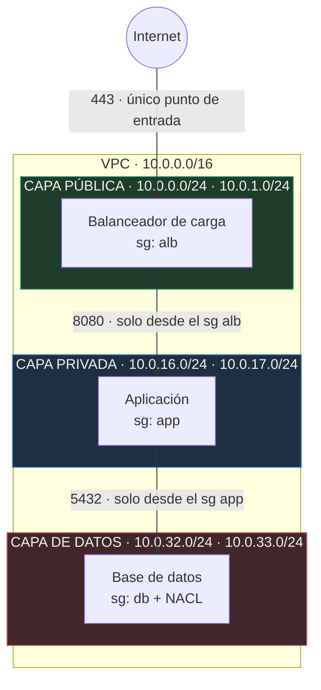
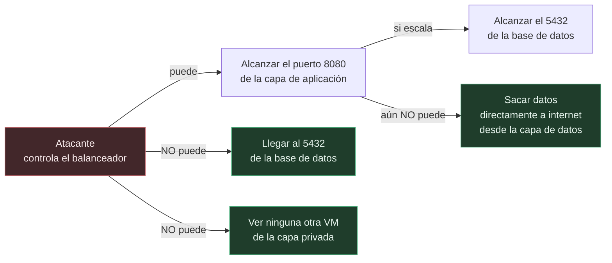
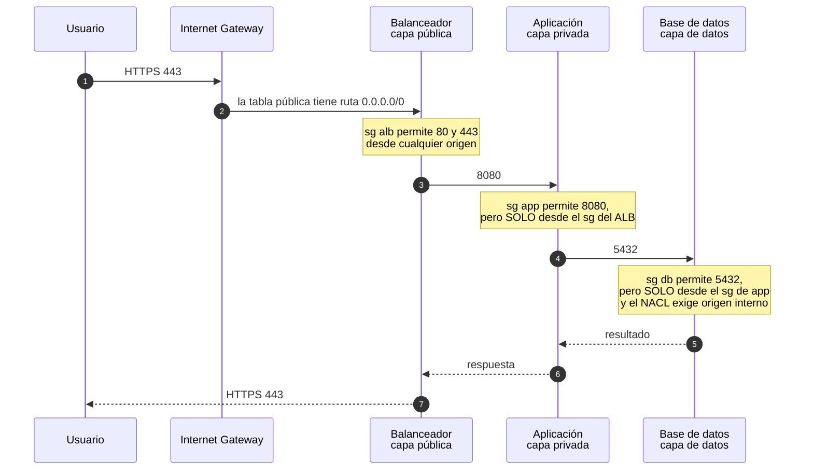
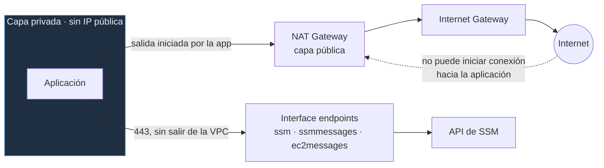
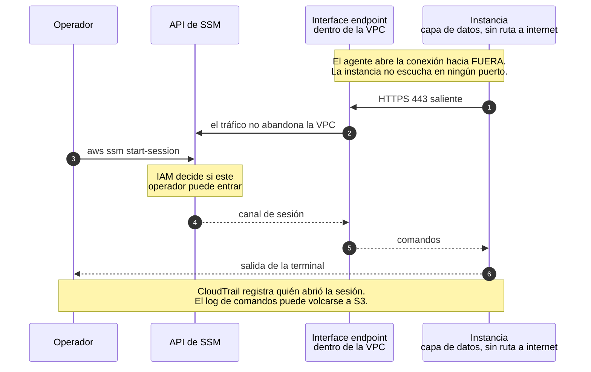
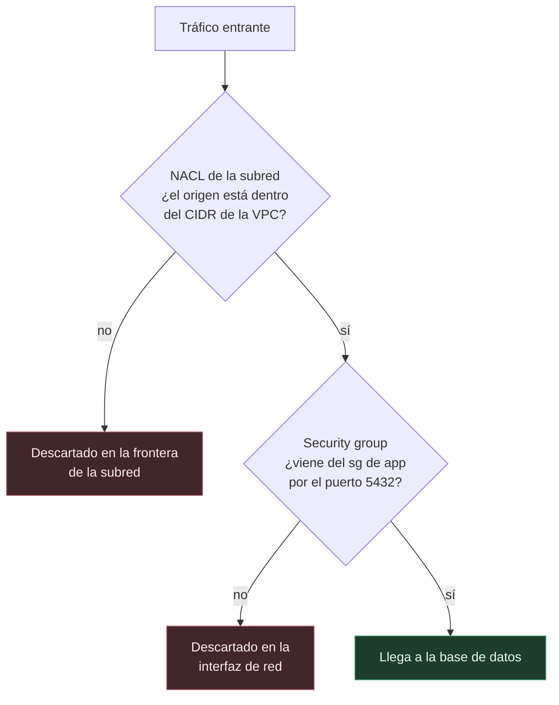

# VPC de tres capas en AWS con Terraform

Red segmentada en AWS para una aplicación web de tres capas. Un balanceador abierto a internet, una capa de aplicación aislada y una capa de datos sin salida al exterior.

Está escrito como módulos de Terraform reutilizables. Se administra sin SSH ni bastión y se verifica con pruebas automatizadas.

El repositorio sirve para desplegarse y para leerse. Cada sección dice primero por qué se toma una decisión y luego cómo se implementa.

## Contenido

- [Qué se despliega](#qué-se-despliega)
- [Arquitectura de tres capas](#arquitectura-de-tres-capas)
- [Cómo viaja una petición](#cómo-viaja-una-petición)
- [Diseño del direccionamiento](#diseño-del-direccionamiento)
- [Salida a internet sin exposición](#salida-a-internet-sin-exposición)
- [Administración sin SSH con Session Manager](#administración-sin-ssh-con-session-manager)
- [Las dos barreras de la capa de datos](#las-dos-barreras-de-la-capa-de-datos)
- [El estado de Terraform en S3](#el-estado-de-terraform-en-s3)
- [Herramientas](#herramientas)
- [Antes de empezar](#antes-de-empezar)
- [Paso 1. Probar el módulo](#paso-1-probar-el-módulo)
- [Paso 2. Crear el bucket de estado](#paso-2-crear-el-bucket-de-estado)
- [Paso 3. Desplegar el entorno](#paso-3-desplegar-el-entorno)
- [Paso 4. Comprobar el acceso sin SSH](#paso-4-comprobar-el-acceso-sin-ssh)
- [Limpieza](#limpieza)
- [Pruebas](#pruebas)
- [Decisiones de implementación](#decisiones-de-implementación)
- [Bugs](#bugs)
- [Solución de problemas](#solución-de-problemas)
- [Referencia](#referencia)

---

## Qué se despliega

- Una VPC con resolución DNS habilitada
- Seis subredes, tres capas por dos zonas de disponibilidad
- Un Internet Gateway y una tabla de rutas por capa
- NAT Gateway configurable, para que la capa privada salga sin ser alcanzable
- Interface endpoints de Systems Manager, para entrar a las máquinas sin abrir puertos
- Tres security groups encadenados y una NACL en la capa de datos
- Flow logs de la VPC en CloudWatch



Mira lo que falta en el diagrama. Ninguna flecha une la capa de datos con internet. Eso no se consigue con una regla que lo prohíba, sino con una ausencia. La tabla de rutas de esas subredes no tiene ninguna entrada hacia `0.0.0.0/0`. El camino no existe.

---

## Arquitectura de tres capas

Lo más rápido para desplegar algo en AWS es una VPC plana. Todas las instancias en subredes públicas, cada una con su IP pública, y los security groups como único filtro. Funciona y se monta en minutos.

El problema aparece cuando algo falla. Cualquier instancia con IP pública forma parte de la superficie expuesta. Una sola regla mal escrita deja la base de datos accesible desde internet. Como todo comparte el mismo espacio de red, que la configuración sea correcta depende de que todas las reglas estén bien todo el tiempo.

Al dividir la red en capas cambia la pregunta de seguridad. Ya no es si cada regla está bien. Es hasta dónde llega alguien que comprometa una capa concreta. Y esa pregunta tiene una respuesta acotada.



Cada capa acepta tráfico de un solo sitio y por un solo puerto. El balanceador es lo único que se alcanza desde internet, y lo único que habla con la aplicación. La base de datos solo atiende a la aplicación. Comprometer una capa da acceso a la siguiente, no a todo.

La capa de datos tiene algo que las otras no. Al no tener ruta de salida, tampoco sirve para sacar información. Quien llegue ahí tiene que volver por donde vino, y ese camino pasa por capas que registran su tráfico en los flow logs.

Hay un motivo más formal. PCI DSS, ISO 27001 y casi todos los marcos de auditoría piden que los datos estén en una red sin acceso directo a internet. La evidencia es la tabla de rutas de la capa de datos, que no tiene ruta por defecto.

---

## Cómo viaja una petición



Fíjate en los pasos 3 y 5. Las reglas no autorizan un rango de direcciones, autorizan un security group. La de la capa de aplicación dice que acepta tráfico de lo que tenga puesto el security group `alb`.

La diferencia se nota cuando alguien lanza una máquina nueva en la subred privada. Con un CIDR, esa máquina habla con la base de datos solo por estar en la subred correcta. Con una referencia a security group no puede, salvo que alguien le asigne el grupo a propósito. El permiso deja de depender de dónde está la máquina y pasa a depender de qué es.

Estas reglas aguantan además los cambios de direccionamiento. Si renumeras la red mañana, siguen siendo correctas sin tocarlas.

---

## Diseño del direccionamiento

El bloque CIDR de una VPC no se puede reducir ni cambiar una vez creada. Se pueden añadir bloques secundarios, pero el rango principal es para siempre. Conviene pensarlo antes de escribir la primera línea.

### Elegir el rango de la VPC

Las direcciones privadas disponibles son las del RFC 1918.

| Rango | Máscara | Direcciones |
|---|---|---|
| `10.0.0.0` | `/8` | 16.777.216 |
| `172.16.0.0` | `/12` | 1.048.576 |
| `192.168.0.0` | `/16` | 65.536 |

Aquí usamos `10.0.0.0/16`, que da 65.536 direcciones. Pero el tamaño no es lo único que decide. Dos VPC con rangos solapados no se pueden emparejar. Si algún día necesitas VPC peering, un Transit Gateway o una VPN contra la red de una empresa, cualquier solapamiento te obliga a rehacer la red o a montar traducción de direcciones. Reserva un rango distinto para cada entorno y apúntalo en algún sitio.

> **Nota.** AWS acepta máscaras de `/16` a `/28` para una VPC. Un `/16` deja libre el tercer octeto entero.

### Cómo se calculan las subredes

Las subredes no están escritas a mano. Se calculan con `cidrsubnet`, que parte una red en trozos.

```
cidrsubnet("10.0.0.0/16", 8, 17)
              │            │   │
              │            │   └── número de bloque que quieres
              │            └────── bits que añades al prefijo
              └─────────────────── red de partida

/16 + 8 bits = /24        →  el bloque 17 es 10.0.17.0/24
```

Añadir 8 bits a un `/16` da redes `/24`. Quedan 8 bits para numerar bloques, así que hay 256 disponibles, de `10.0.0.0/24` a `10.0.255.0/24`. El tercer octeto coincide con el número de bloque, así que el direccionamiento se lee de un vistazo.

El número de bloque sale de sumar dos valores.

```hcl
cidr = cidrsubnet(var.vpc_cidr, 8, offset + idx)
```

`offset` identifica la capa y viene de la variable `tier_offsets`. `idx` identifica la zona, y vale 0 para la primera y 1 para la segunda.

Con los valores por defecto (`public = 0`, `private = 16`, `data = 32`) sale esto.

| Capa | Offset | Zona a (idx 0) | Zona b (idx 1) |
|---|---|---|---|
| Pública | 0 | `10.0.0.0/24` | `10.0.1.0/24` |
| Privada | 16 | `10.0.16.0/24` | `10.0.17.0/24` |
| Datos | 32 | `10.0.32.0/24` | `10.0.33.0/24` |

### Por qué las capas van de 16 en 16

Esa separación reserva 16 bloques `/24` a cada capa, y tiene dos efectos prácticos.

Puedes crecer hasta 16 zonas por capa sin renumerar nada. Si mañana pasas de 2 zonas a 3, la nueva subred privada será `10.0.18.0/24`, que ya está libre. Con capas pegadas una detrás de otra, añadir una zona se metería en el rango de la siguiente y habría que mover subredes existentes. En Terraform eso significa destruirlas y recrearlas.

Y se lee más rápido en una incidencia. Al ver una dirección en un log sabes de qué capa es por el tercer octeto. De 0 a 15 pública, de 16 a 31 privada, de 32 a 47 datos.

La variable valida que los offsets sean múltiplos de 16, para que el esquema no se rompa por descuido.

```hcl
validation {
  condition     = alltrue([for o in values(var.tier_offsets) : o % 16 == 0])
  error_message = "Cada offset debe ser múltiplo de 16 para reservar 16 bloques /24 por capa."
}
```

### Por qué subredes /24

Un `/24` tiene 256 direcciones. AWS reserva cinco en toda subred.

| Dirección | Uso |
|---|---|
| `.0` | Identificador de red |
| `.1` | Router de la VPC |
| `.2` | Servidor DNS de AWS |
| `.3` | Reservada para uso futuro |
| `.255` | Dirección de difusión |

Quedan 251 direcciones útiles por subred.

El compromiso va en las dos direcciones. Con subredes más pequeñas, como un `/26` de 59 direcciones útiles, te arriesgas a quedarte sin IPs. En Amazon EKS cada pod consume una dirección de la subred, y en Fargate cada tarea consume otra, así que la subred te limita la escala antes que la CPU o la memoria. Con subredes más grandes, como un `/20`, desperdicias espacio que quizá quieras para otras capas o entornos.

> **Nota.** El tamaño se cambia tocando el segundo argumento de `cidrsubnet`. Hacerlo sobre una red ya desplegada implica recrear las subredes y todo lo que viva dentro.

---

## Salida a internet sin exposición

La aplicación necesita salir a internet para bajar actualizaciones o llamar a APIs de terceros. Y nadie de fuera debe poder iniciar una conexión hacia ella. Son dos cosas distintas y se confunden a menudo.



El NAT Gateway resuelve la primera mitad. Traduce las conexiones que salen y deja volver sus respuestas, pero no acepta nada que empiece fuera. Es asimétrico a propósito.

`nat_strategy` decide cuántos se despliegan.

| Valor | NAT desplegados | Si se cae una zona |
|---|---|---|
| `none` | Ninguno | La capa privada nunca tiene salida |
| `single` | Uno, en la primera zona | Si cae esa zona, todas las subredes privadas pierden la salida |
| `per_az` | Uno por zona | Las demás zonas siguen funcionando |

Las tablas de rutas privadas se crean por zona en los tres casos. Pasar de `single` a `per_az` es cambiar una variable, no rehacer el módulo.

---

## Administración sin SSH con Session Manager

Para entrar a máquinas en subredes privadas, lo tradicional es un bastión. Una instancia en la subred pública con el puerto 22 accesible, desde la que saltas al resto.

Ese diseño arrastra varias cosas.

- El puerto 22 queda expuesto a internet y recibe intentos de acceso todo el rato
- Hay que repartir claves SSH al equipo, rotarlas y revocarlas cuando alguien se va
- El bastión es una máquina más que parchear y vigilar
- Ante una auditoría, saber quién entró a qué máquina y qué ejecutó depende de que alguien haya guardado los registros del propio bastión

Session Manager le da la vuelta a la dirección de la conexión.



| | Bastión con SSH | Session Manager |
|---|---|---|
| Puertos de entrada abiertos | 22, expuesto a internet | Ninguno |
| Credenciales | Claves SSH que repartir y rotar | IAM, y al quitar el permiso el acceso se corta al momento |
| Auditoría | Los registros del bastión, si se guardan | CloudTrail por sesión, con volcado opcional de comandos a S3 o CloudWatch |
| Infraestructura extra | Una instancia que mantener y parchear | Ninguna |
| Funciona sin salida a internet | No, salvo montajes adicionales | Sí, con interface endpoints |

El módulo despliega tres endpoints y los tres hacen falta.

| Endpoint | Para qué sirve |
|---|---|
| `ssm` | La API de Systems Manager |
| `ssmmessages` | El canal de datos de la sesión interactiva |
| `ec2messages` | La comunicación del agente con el servicio |

Estos endpoints son los que hacen que todo funcione en la capa de datos, que no tiene ruta a internet. El tráfico hacia la API de AWS entra por una interfaz de red que vive dentro de tu VPC y no pasa por la red pública.

> **Nota.** Session Manager necesita `enable_dns_support` y `enable_dns_hostnames` en la VPC. Sin resolución DNS, los endpoints no resuelven sus nombres privados y la sesión no se abre. Los dos están fijados en el módulo y hay una prueba que lo comprueba.

---

## Las dos barreras de la capa de datos

La capa de datos está protegida por dos mecanismos. No es la misma medida puesta dos veces.



Se diferencian en tres cosas.

**Dónde actúan.** La NACL filtra en la frontera de la subred, antes de que el paquete llegue a la máquina. El security group filtra en la interfaz de red de la instancia.

**Quién los toca.** Alguien con permisos sobre EC2 puede cambiar un security group. La NACL se gestiona a nivel de red, que en una empresa con funciones separadas es otro equipo y otros permisos. Un error en un lado no atraviesa el otro.

**Cómo se comportan.** El security group guarda estado, así que si permites la entrada, la respuesta sale sola. La NACL no guarda estado, y por eso hay que declarar la salida a mano. Es el detalle que más confunde la primera vez, y el motivo de que el módulo declare las dos direcciones.

```hcl
resource "aws_network_acl_rule" "data_egress_vpc" {
  network_acl_id = aws_network_acl.data.id
  rule_number    = 100
  egress         = true          # sin esta regla, las respuestas no salen
  protocol       = "-1"
  rule_action    = "allow"
  cidr_block     = var.vpc_cidr
}
```

Lo que no encaje con ninguna regla queda denegado por la regla implícita que cierra toda NACL y que no se puede quitar.

---

## El estado de Terraform en S3

Terraform guarda un archivo de estado con la correspondencia entre lo que declara tu código y lo que existe en AWS. Es lo que le permite saber que `aws_vpc.this` es `vpc-0b6e701a441c2648c`.

Por defecto ese archivo se guarda junto al código. En cuanto el proyecto deja de ser de una sola persona, eso da problemas.

- **Nadie más puede trabajar.** Si el estado está en tu portátil, un compañero que ejecute `apply` no sabe qué existe ya e intenta crear cosas duplicadas.
- **No hay bloqueo.** Dos ejecuciones a la vez parten del mismo estado y la última en escribir pisa a la otra. Quedan recursos huérfanos que Terraform ya no controla.
- **No hay copia de seguridad.** El estado es el único registro de lo que has desplegado. Si se corrompe o se borra, recuperar el control significa importar los recursos uno a uno.
- **Se sube al repo sin querer.** El archivo tiene valores en claro, incluidos los que marques como sensibles.

El stack de `bootstrap/` crea un bucket de S3 configurado para tapar esos agujeros.

| Configuración | Qué resuelve |
|---|---|
| Versionado | Cada `apply` deja recuperable la versión anterior, por si una escritura sale mal |
| Cifrado en reposo | El estado tiene valores sensibles |
| Bloqueo de acceso público | Evita que una policy mal escrita lo deje abierto |
| Policy que deniega tráfico sin TLS | Rechaza cualquier acceso que no vaya cifrado |
| `prevent_destroy` | Evita que un `terraform destroy` ahí borre el estado de todos los entornos |

El bloqueo de concurrencia se activa con una línea.

```hcl
terraform {
  backend "s3" {
    key          = "network/dev/terraform.tfstate"
    encrypt      = true
    use_lockfile = true
  }
}
```

> **Nota.** `use_lockfile` existe desde Terraform 1.11. Antes el bloqueo pedía una tabla de DynamoDB dedicada solo a eso. Si miras guías más viejas, verás esa tabla en todos los ejemplos.

Cada entorno escribe en una ruta distinta del mismo bucket, que marca el atributo `key`. Dos configuraciones apuntando a la misma ruta compartirían estado, y un `apply` en una podría destruir los recursos de la otra.

El nombre del bucket no está en el código. Los nombres de bucket de S3 son únicos en todo AWS, no dentro de tu cuenta. Como el nombre lleva el identificador de cuenta, escribirlo en `backend.tf` haría que el repositorio solo funcionase en la cuenta de quien lo creó. Por eso el bloque `backend` se deja incompleto y los valores se pasan al inicializar, con un archivo `backend.hcl` que git ignora y del que se versiona una plantilla `.example`. La técnica se llama *partial backend configuration*. El backend se evalúa antes que las variables y los `locals`, así que no hay forma de calcular ese nombre dentro de Terraform.

---

## Herramientas

- **Terraform 1.11 o superior.** Hace falta esa versión por el bloqueo de estado nativo de S3. Las pruebas usan `terraform test`, que viene incluido.
- **AWS CLI.** Para las credenciales y para abrir sesiones con `aws ssm start-session`.
- **make.** Atajos de las tareas repetidas. `make help` los lista.
- **Amazon Linux 2023.** La AMI de la instancia de demostración. Se resuelve con un data source, así que no hay ningún ID fijo en el código.

El provider de AWS está fijado a la serie `~> 5.0`. Los archivos `.terraform.lock.hcl` están versionados, así que todo el mundo instala las mismas versiones.

---

## Antes de empezar

Necesitas Terraform 1.11 o superior, el AWS CLI configurado con credenciales válidas, y permisos para crear recursos de VPC, IAM, S3 y CloudWatch.

```bash
terraform version
aws sts get-caller-identity
```

---

## Paso 1. Probar el módulo

Antes de montar el backend remoto puedes desplegar la arquitectura entera con el ejemplo autocontenido. Guarda el estado en un archivo local y no necesita preparación.

```bash
git clone git@github.com:Rxcxrdx/aws-three-tier-vpc-terraform.git
cd aws-three-tier-vpc-terraform/examples/minimal

terraform init
terraform apply
```

Al terminar, mira lo que se creó.

```bash
terraform output subnets_by_tier
```

Para borrarlo.

```bash
terraform destroy
```

---

## Paso 2. Crear el bucket de estado

Esto se hace una sola vez por cuenta. El stack de `bootstrap/` crea el bucket donde los entornos guardan su estado, incluido el suyo propio. Ahí hay una dependencia circular, porque la primera ejecución no puede usar un bucket que todavía no existe. Se resuelve en dos fases.

**Fase 1.** Abre `bootstrap/backend.tf` y comenta el bloque `terraform { backend "s3" { ... } }`. Terraform usará un estado local.

```bash
cd bootstrap
terraform init
terraform apply

terraform output -raw tfstate_bucket_name
```

Apunta el nombre que sale del último comando.

**Fase 2.** Descomenta el bloque, prepara la configuración del backend y migra el estado al bucket que acabas de crear.

```bash
cp backend.hcl.example backend.hcl
# edita backend.hcl con el nombre del bucket

terraform init -backend-config=backend.hcl -migrate-state
```

Terraform ve que hay un estado local y te ofrece copiarlo al backend remoto. Si aceptas, el archivo local ya no sirve.

---

## Paso 3. Desplegar el entorno

```bash
cd ../envs/dev

cp backend.hcl.example backend.hcl
# el mismo bucket del paso anterior

terraform init -backend-config=backend.hcl
terraform plan
terraform apply
```

Lee la salida de `plan` antes de aplicar. Debe crear la VPC, seis subredes, las tablas de rutas, el NAT Gateway, los tres endpoints de SSM, los security groups y la NACL.

---

## Paso 4. Comprobar el acceso sin SSH

El repositorio trae una demostración que prueba el acceso sin SSH en el peor escenario posible. Una instancia en la subred de datos, que no tiene ruta a internet ni par de claves.

Viene apagada porque es una comprobación puntual y no forma parte de la infraestructura.

```bash
terraform apply -var enable_ssm_test=true

aws ssm start-session --target $(terraform output -raw instance_id)
```

Si la sesión se abre, has comprobado tres cosas de golpe. Que los endpoints resuelven, que el rol de IAM da los permisos correctos y que no hace falta ningún puerto de entrada. Para quitarla.

```bash
terraform apply -var enable_ssm_test=false
```

---

## Limpieza

```bash
cd envs/dev
terraform destroy
```

Los atajos equivalentes.

```bash
make nuke     # destruye el entorno
make cost     # comprueba que no queda nada activo en la cuenta
```

> **Nota.** El stack de `bootstrap/` no se destruye al terminar de trabajar. Guarda el estado de los entornos y lleva `prevent_destroy` justo para evitarlo.

---

## Pruebas

```bash
terraform test
```

La suite comprueba lo siguiente.

- Que se crea una subred por cada combinación de capa y zona
- Que los bloques CIDR salen con el offset esperado
- Que las subredes de datos no asignan IP pública
- Que la tabla de rutas de la capa de datos no tiene ninguna ruta hacia `0.0.0.0/0`
- Que la resolución DNS sigue activa, porque Session Manager la necesita
- Que las capas se referencian por security group y no por CIDR
- Que el security group por defecto queda sin reglas

Las pruebas corren con `nat_strategy = "none"` y los endpoints apagados, así que la suite no deja infraestructura persistente.

---

## Decisiones de implementación

**`for_each` con claves de texto en vez de `count`.** Con `count`, la identidad de un recurso en el estado es su posición en la lista. Si borras un elemento del medio, todos los siguientes se desplazan y Terraform destruye y recrea recursos que no habían cambiado. Con claves como `private-us-east-1a`, borrar una subred afecta solo a esa. A cambio, renombrar una clave sí fuerza la recreación. Por eso las claves se forman con capa y zona, que son los dos datos que no cambian nunca.

**Las zonas se consultan con un data source.** AWS reparte los nombres de zona de forma aleatoria por cuenta, así que `us-east-1a` puede ser una instalación física distinta en dos cuentas. Escribir los nombres a mano haría impredecible el reparto entre zonas al desplegar en otra cuenta.

**Los tags se usan como datos.** Las asociaciones de tablas de rutas y los outputs filtran por el tag `Tier`. La alternativa era interpretar el prefijo del nombre de la clave, y eso ata el módulo a un formato de texto que cualquiera puede cambiar.

**Las reglas de firewall son recursos sueltos.** `aws_vpc_security_group_ingress_rule` en vez de bloques `ingress` anidados hace que cada regla tenga su propia entrada en el estado. Añadir una no reescribe las demás, y el `plan` enseña exactamente cuál cambia.

**El security group por defecto se vacía.** AWS crea uno con cada VPC que permite todo el tráfico entre los recursos que lo tengan puesto, y es el que reciben las instancias lanzadas sin especificar security group. Como no se puede borrar, el módulo lo adopta y lo deja sin reglas.

---

## Bugs

Si algo no funciona o hay una parte confusa, abre una issue. Incluye lo siguiente.

- el directorio donde pasó, por ejemplo `envs/dev` o `examples/minimal`
- el comando que ejecutaste
- la versión de Terraform y la del provider de AWS
- qué esperabas ver
- qué viste

---

## Solución de problemas

**El apply falla al crear los VPC endpoints fuera de `us-east-1`.** El nombre del servicio de un endpoint lleva la región dentro. Si está escrito fijo, desplegar en otra región da un error que no menciona la región como causa. El módulo la saca con `data "aws_region"`, así que funciona en cualquiera.

**Session Manager no conecta aunque los endpoints existan.** Mira `enable_dns_support` y `enable_dns_hostnames` en la VPC. Sin ellos los endpoints no resuelven sus nombres privados. El síntoma aparece bastante después de la causa y el error no habla del DNS.

**Una prueba falla con `Unknown condition value`.** La aserción depende de un valor que no se conoce hasta el `apply`, como el identificador de un security group. Durante el `plan` ese valor es *known after apply*. Ejecuta esa prueba con `command = apply`, o reescribe la aserción sobre un atributo que sí se conozca al planificar.

**Queda un NAT Gateway activo después de interrumpir las pruebas.** Si una ejecución se corta antes del teardown, lo que se creó se queda. Ejecuta `make cost` para encontrarlo. Las pruebas usan `nat_strategy = "none"` para que eso no pase.

---

## Referencia

```
├── bootstrap/          Bucket de estado versionado y cifrado. Se ejecuta una vez.
├── modules/
│   ├── network/        VPC, subredes, rutas, NAT, endpoints y flow logs
│   └── security/       Security groups encadenados, NACL y default SG vaciado
├── examples/minimal/   Despliegue autocontenido con estado local
├── envs/dev/           Entorno con estado remoto en S3
└── tests/              Suite de terraform test
```

Cada módulo documenta sus entradas, sus salidas y sus compromisos de diseño.

- [modules/network](modules/network/README.md)
- [modules/security](modules/security/README.md)
- [bootstrap](bootstrap/README.md)

MIT. La licencia está en [LICENSE](LICENSE).
