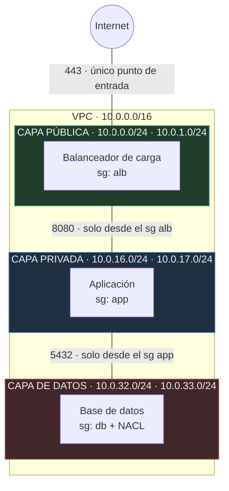
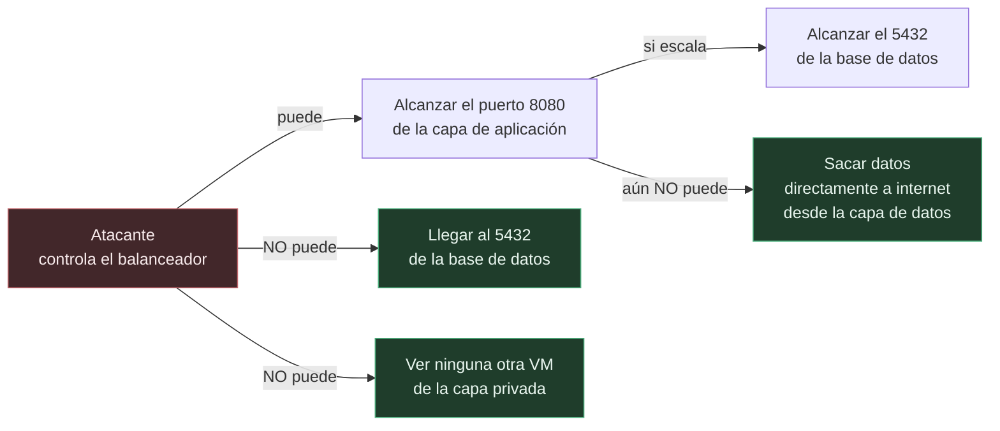
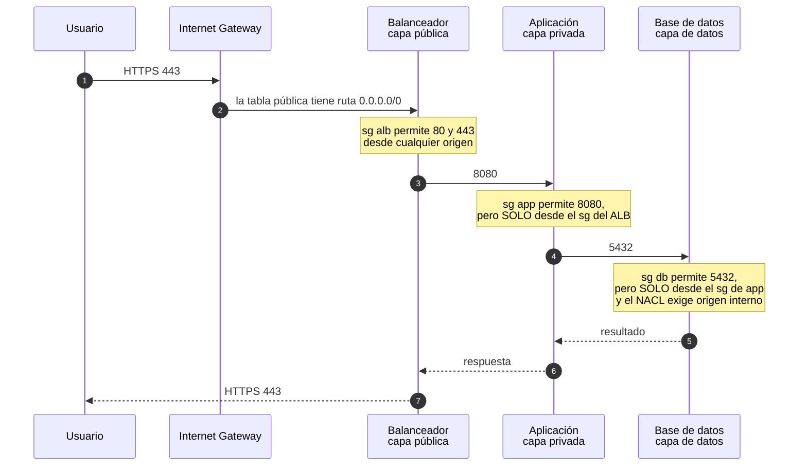
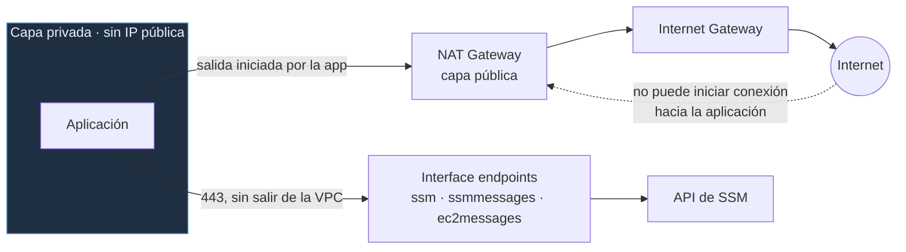
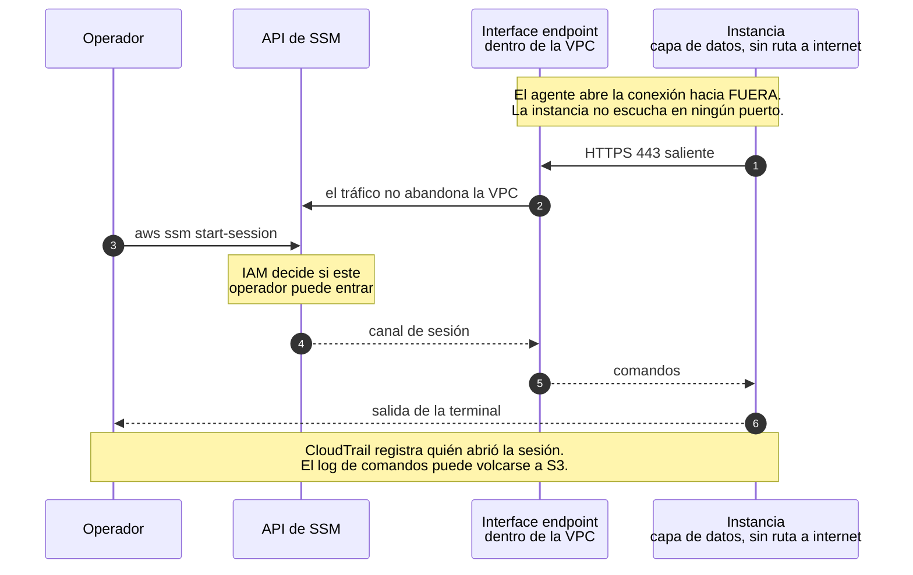
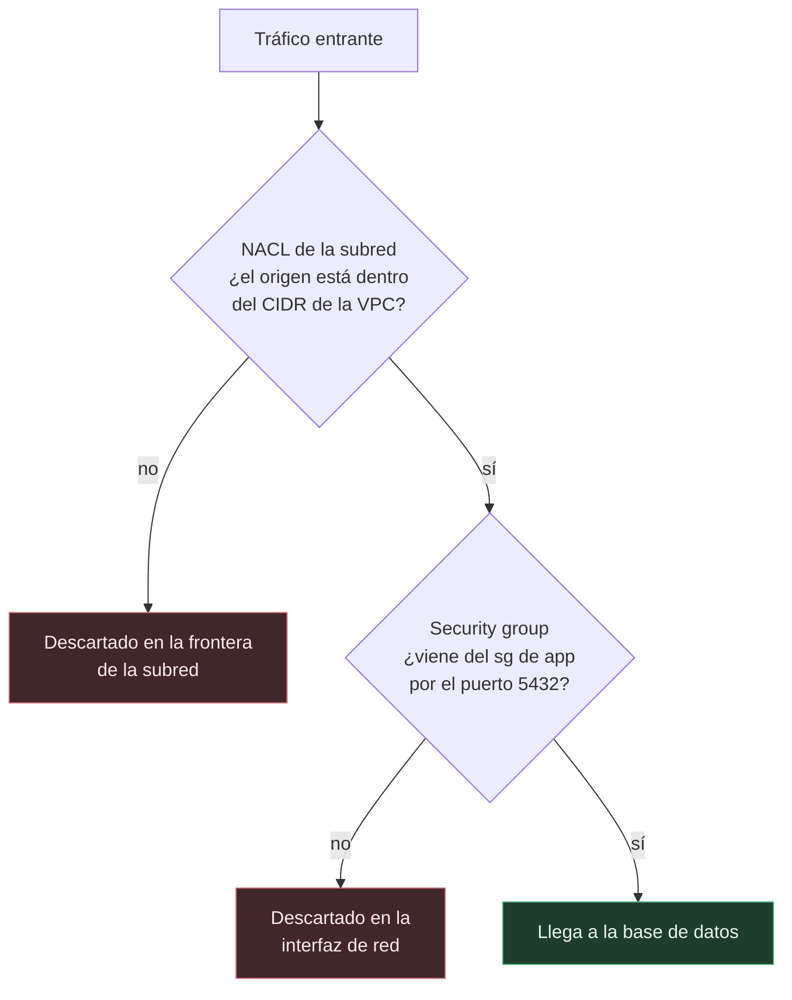

# VPC de tres capas en AWS con Terraform

Red segmentada para una aplicación web, con las tres capas clásicas —balanceador, aplicación y base de datos— repartidas en varias zonas de disponibilidad. Está escrita como módulos reutilizables, se administra sin SSH y sin bastión, y trae una suite de tests que se ejecuta sin crear un solo recurso de pago.



Fíjate en lo que **no** aparece: ninguna flecha sale de la capa de datos hacia internet. No es que una regla lo prohíba, es que la tabla de rutas de esas subredes no tiene ninguna entrada `0.0.0.0/0`. El camino no existe.

---

## Índice

- [Por qué tres capas](#por-qué-tres-capas)
- [Cómo viaja una petición](#cómo-viaja-una-petición)
- [Salir sin exponerse](#salir-sin-exponerse)
- [Por qué SSM y no un bastión](#por-qué-ssm-y-no-un-bastión)
- [Dos barreras con dueños distintos](#dos-barreras-con-dueños-distintos)
- [Arrancar](#arrancar)
- [Despliegue completo](#despliegue-completo)
- [Costes](#costes)
- [Decisiones de diseño](#decisiones-de-diseño)
- [Lo que se rompió por el camino](#lo-que-se-rompió-por-el-camino)
- [Tests](#tests)

---

## Por qué tres capas

La alternativa fácil es una VPC plana: todas las instancias en subredes públicas, cada una con su IP, y los security groups haciendo de único filtro. Funciona. El problema aparece cuando algo falla.

En una red plana, cualquier instancia con IP pública es superficie de ataque, y **una sola regla mal escrita expone la base de datos a internet**. He visto ese fallo en producción más veces de las que debería: alguien abre un puerto "un momento para depurar" y el momento dura seis meses.

Segmentar cambia la pregunta. En lugar de "¿está bien esta regla?", la pregunta pasa a ser "si comprometen esta capa, ¿hasta dónde llega el atacante?". Y esa pregunta tiene una respuesta concreta:



Cada capa acepta tráfico de **una sola** procedencia y en **un solo** puerto. El balanceador es lo único expuesto a internet, y lo único que puede hablar con la aplicación. La base de datos solo escucha a la aplicación. Comprometer una capa te da la siguiente, no todas.

La capa de datos añade una propiedad que las otras no tienen: al no existir ruta de salida, tampoco sirve para sacar información. Un atacante que llegue hasta ahí tiene que volver por donde vino, y ese camino de vuelta pasa por capas que sí están vigiladas y registradas en los flow logs.

Hay un motivo más aburrido pero igual de real: PCI-DSS, ISO 27001 y la mayoría de auditorías piden explícitamente que los datos vivan en una subred sin acceso directo a internet. Con esta topología, esa casilla se marca enseñando la tabla de rutas.

---

## Cómo viaja una petición



El detalle importante son los pasos 3 y 5. Las reglas no dicen "acepto tráfico de 10.0.16.0/24", dicen "acepto tráfico de lo que lleve puesto el security group `app`".

La diferencia se nota cuando alguien lanza una instancia nueva en la subred privada. Con un CIDR, esa máquina hereda el permiso de hablar con la base de datos solo por estar en el sitio correcto. Con una referencia a security group, no puede a menos que alguien le asigne el grupo a propósito. El permiso deja de depender de dónde está la máquina y pasa a depender de qué es.

Además sobrevive a los cambios de direccionamiento. Si mañana renumeras la red, las reglas siguen siendo correctas sin tocarlas.

---

## Salir sin exponerse

La capa privada tiene un problema aparente: la aplicación necesita salir a internet para descargar actualizaciones o llamar a APIs de terceros, pero nadie de fuera debe poder iniciar una conexión hacia ella. Son dos cosas distintas que suelen confundirse.



El NAT Gateway resuelve la primera mitad: traduce las conexiones que **salen** y deja volver sus respuestas, pero no acepta nada que empiece desde fuera. Es asimétrico por diseño.

La segunda mitad es la administración, y ahí es donde entran los endpoints. Una máquina en la capa de datos no tiene ni siquiera NAT, así que no puede hablar con la API de AWS por la vía normal. Los interface endpoints ponen esa API dentro de tu propia VPC, en forma de interfaz de red privada. El tráfico nunca toca la red pública.

---

## Por qué SSM y no un bastión

Para administrar máquinas en subredes privadas, lo tradicional es un **bastión**: una instancia en la subred pública con el puerto 22 abierto, desde la que saltas al resto.

Ese diseño arrastra cosas que nadie mira con cariño. El puerto 22 queda expuesto a internet y recibe intentos de acceso constantes. Hay que repartir claves SSH al equipo, y luego rotarlas, y luego revocarlas cuando alguien se va — y esa última parte casi nunca ocurre a tiempo. El bastión es una máquina más que parchear, monitorizar y pagar. Y cuando el auditor pregunta quién entró a qué máquina y qué comandos ejecutó, la respuesta suele ser un encogimiento de hombros.

Session Manager le da la vuelta a la dirección de la conexión:



Lo que se gana:

| | Bastión con SSH | Session Manager |
|---|---|---|
| Puertos de entrada abiertos | 22, expuesto | **Ninguno** |
| Credenciales | Claves SSH que repartir y rotar | IAM: quitas el permiso y el acceso cae al instante |
| Auditoría | Los logs del bastión, si alguien los guarda | CloudTrail por sesión, comandos a S3 o CloudWatch |
| Máquina extra que mantener | Sí | No |
| Funciona sin salida a internet | No, sin trucos | Sí, con interface endpoints |

Los tres endpoints (`ssm`, `ssmmessages`, `ec2messages`) son los que permiten que esto funcione en la capa de datos, que no tiene ruta a internet. El tráfico hacia la API de SSM entra por una interfaz de red dentro de tu propia VPC y nunca sale a la red pública.

**El compromiso honesto**, porque en una entrevista te lo van a preguntar: los endpoints cuestan alrededor de 1,44 USD al día en dos zonas, mientras que un bastión `t3.micro` sale por unos 0,25. En un laboratorio de tres máquinas, SSM es más caro. La cuenta cambia cuando el bastión deja de ser una máquina y pasa a ser un procedimiento: rotación de claves, altas y bajas de personal, parcheado, y la primera auditoría en la que hay que demostrar quién accedió a qué. A partir de ahí, los endpoints son de lo más barato de la factura.

En este repositorio hay una demostración que lo prueba en el sitio más difícil: [`envs/dev/ssm_test.tf`](envs/dev/ssm_test.tf) levanta una instancia en la **subred de datos**, sin ruta a internet y sin par de claves, y abre sesión igual.

```bash
terraform apply -var enable_ssm_test=true
aws ssm start-session --target $(terraform output -raw instance_id)
```

Viene apagada por defecto. Es evidencia, no infraestructura.

---

## Dos barreras con dueños distintos

La capa de datos está protegida dos veces, y no por desconfianza en la primera:



No son la misma medida repetida. Se diferencian en tres cosas:

**Dónde actúan.** El NACL filtra en la frontera de la subred, antes de que el paquete llegue a la máquina. El security group filtra en la interfaz de red de la instancia.

**Quién los administra.** Alguien con permisos sobre EC2 puede modificar un security group. El NACL se toca a nivel de red, que en una organización con separación de funciones es otro equipo y otro conjunto de permisos. Un error o un abuso en un lado no atraviesa el otro.

**Cómo funcionan.** El security group tiene estado: si permites la entrada, la respuesta sale sola. El NACL no lo tiene, y por eso hay que escribir la regla de salida explícitamente. Ese es el detalle donde se atasca casi todo el mundo la primera vez, y por qué el módulo declara las dos direcciones.

---

## Arrancar

Para verlo funcionando basta con credenciales de AWS y permiso para crear redes:

```bash
git clone git@github.com:Rxcxrdx/aws-three-tier-vpc-terraform.git
cd aws-three-tier-vpc-terraform/examples/minimal

terraform init
terraform apply
```

Levanta la VPC, las seis subredes, las tablas de rutas, los tres security groups y el NACL. El state se guarda en un archivo local, así que no hay que preparar nada antes.

```bash
terraform destroy
```

Este ejemplo existe porque el entorno real de `envs/dev` guarda el state en S3, y eso obliga a ejecutar antes el bootstrap. Para alguien que solo quiere ver qué hace el módulo, son diez minutos de preparativos antes de la primera subred. Aquí no hay ninguno.

---

## Despliegue completo

El entorno de `envs/dev` guarda el state en S3, que es como se trabaja cuando hay más de una persona tocando la infraestructura. La preparación se hace **una vez por cuenta**.

### Requisitos

Terraform 1.11 o superior, porque el bloqueo de state nativo de S3 (`use_lockfile`) es de esa versión en adelante. Antes hacía falta una tabla de DynamoDB dedicada solo a impedir dos `apply` simultáneos.

```bash
terraform version
aws sts get-caller-identity
```

### 1. Crear el bucket de state

Aquí hay un huevo y una gallina: este stack crea el bucket donde se guarda el state, incluido el suyo, que la primera vez todavía no existe.

```bash
cd bootstrap

# Comenta el bloque backend de backend.tf: el state se queda en local
terraform init
terraform apply

terraform output -raw tfstate_bucket_name
```

Descomenta el bloque y migra el state al bucket que se acaba de crear:

```bash
cp backend.hcl.example backend.hcl    # con el nombre del bucket dentro
terraform init -backend-config=backend.hcl -migrate-state
```

### 2. Desplegar

```bash
cd ../envs/dev

cp backend.hcl.example backend.hcl
terraform init -backend-config=backend.hcl

terraform plan
terraform apply
```

El nombre del bucket **no está escrito en el código**. Lleva el número de cuenta, y los nombres de bucket de S3 son únicos en todo AWS, no por cuenta: si estuviera fijo en `backend.tf`, este repositorio solo funcionaría en la cuenta de quien lo escribió. Va en un `backend.hcl` que git ignora, con su plantilla `.example` al lado.

### 3. Destruir

```bash
make nuke     # terraform destroy en el entorno
make cost     # comprueba que no quedó nada encendido
```

---

## Costes

Casi todo lo que crea este módulo es gratis. El gasto se concentra en dos recursos, y los dos se apagan con una variable:

| Recurso | Aproximado | Variable |
|---|---|---|
| VPC, subredes, rutas, IGW, security groups, NACL | 0 | — |
| NAT Gateway | ~1,08 USD/día cada uno | `nat_strategy` |
| Endpoints de SSM | ~1,44 USD/día los tres en dos zonas | `enable_ssm_endpoints` |
| Instancia de demostración | ~0,25 USD/día | `enable_ssm_test` |
| Flow logs | según volumen | `enable_flow_logs` |

Cifras de `us-east-1`, orientativas. `examples/minimal` y la suite de tests van con los dos primeros apagados.

---

## Decisiones de diseño

**`for_each` con claves de texto, no `count`.** Con `count`, la identidad de un recurso en el state es su posición en la lista. Si borras la subred del medio, todas las siguientes se corren un puesto y Terraform destruye y recrea recursos que nadie pidió tocar. Con claves como `private-us-east-1a`, borrar una afecta solo a esa. A cambio, renombrar una clave sí fuerza la recreación, así que las claves usan capa y zona: los dos datos que no cambian nunca.

**Las zonas se consultan, no se escriben a mano.** AWS aleatoriza los nombres de zona por cuenta. Tu `us-east-1a` y el mío pueden ser datacenters físicos distintos. Si las fijas en el código, el reparto entre zonas se vuelve impredecible al desplegar en otra cuenta.

**Los tags son datos, no decoración.** Las asociaciones de rutas y los outputs filtran por el tag `Tier`. La alternativa era parsear el prefijo del nombre de la clave, que funciona hasta que alguien cambia el formato del nombre.

**Una tabla de rutas privada por zona desde el principio**, aunque con `nat_strategy = "single"` las dos apunten al mismo NAT. Pasar a un NAT por zona es cambiar una variable en lugar de reestructurar el módulo.

**Las reglas de firewall son recursos independientes** (`aws_vpc_security_group_ingress_rule`) en vez de bloques `ingress` dentro del security group. Cada regla tiene su entrada en el state, así que añadir una no reescribe las demás y el plan enseña exactamente cuál cambia.

**El security group por defecto se vacía.** AWS crea uno con cada VPC que permite todo el tráfico entre los recursos que lo tengan puesto, y es el que se asigna a cualquier instancia lanzada sin especificar security group. Es la puerta trasera que salta todo lo anterior. No se puede borrar, pero sí dejar sin reglas.

---

## Lo que se rompió por el camino

**Un NAT Gateway olvidado encendido.** Los tests desplegaban la red completa para comprobar una ruta. Si la ejecución se corta a medias —Ctrl+C, el portátil que se suspende— el teardown no llega a correr y el NAT sigue facturando. De ahí salió `nat_strategy = "none"`. Ahora la suite entera corre sin crear nada de pago, y el interruptor resultó útil también para el ejemplo.

**El DNS de la VPC como prerrequisito invisible.** Con `enable_dns_hostnames` desactivado, los interface endpoints no resuelven sus nombres privados y Session Manager no conecta nunca. El error aparece varias fases más tarde y no menciona el DNS por ningún lado. Hay un test dedicado a que nadie lo apague por descuido.

**Un test que no se podía evaluar.** La comprobación de que la capa de aplicación referencia al balanceador fallaba con `Unknown condition value`. El ID de un security group no existe hasta el `apply`, y en `plan` es un valor desconocido. La solución fue separar las pruebas según lo que cada fase puede saber, y montar en `tests/setup/` una VPC de usar y tirar, más pequeña que el módulo real, sobre la que aplicar los security groups sin crear nada caro.

---

## Tests

```bash
terraform test
```

Comprueban el conteo y el direccionamiento de las subredes, que la capa de datos siga sin ruta a internet, que el DNS no se haya apagado, que los interruptores de coste apaguen de verdad el NAT, y que las capas se sigan referenciando entre sí en lugar de por CIDR. **No crean recursos de pago.**

---

## Estructura

```
├── bootstrap/          Bucket de state versionado y cifrado. Se ejecuta una vez.
├── modules/
│   ├── network/        VPC, subredes, rutas, NAT, endpoints y flow logs
│   └── security/       Security groups encadenados, NACL y default SG vaciado
├── examples/minimal/   Despliegue sin backend remoto ni recursos de pago
├── envs/dev/           Entorno real con state en S3
└── tests/              Suite de terraform test
```

Cada módulo tiene su README con entradas, salidas y compromisos: [network](modules/network/README.md) · [security](modules/security/README.md) · [bootstrap](bootstrap/README.md).

## Licencia

MIT. Ver [LICENSE](LICENSE).
